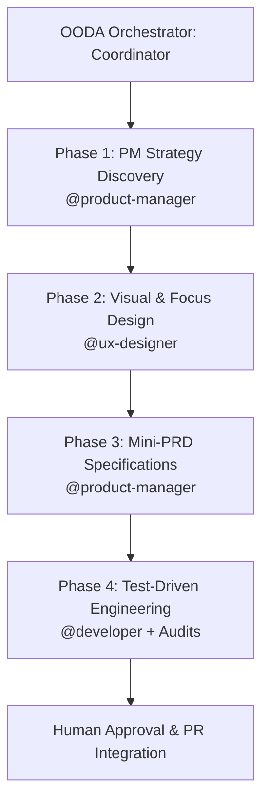

# Agentic Workflow Skill

This skill defines the rigorous, multi-agent process for developing and reviewing user journeys, features, and fixes in the Kanbrio monorepo.

## The Standard Multi-Agent Lifecycle Pipeline

Every new user journey, layout modification, or critical blocker correction MUST progress through this 4-phase lifecycle coordinated by the `@ooda-orchestrator`:

---

### Phase 1: Onboarding & Feature Strategy Discovery (`@product-manager`)
*   **Goal**: Define product value, user stories, and onboarding retention strategy.
*   **Key Decisions**: Determine onboarding strategy (e.g., zero-friction automatic provisioning vs. manual prompt modal).
*   **Tasks**:
    1. Conduct context discovery using the `product-discovery` skill.
    2. Draft Jobs-to-be-Done (JTBD) and user outcomes (e.g., *"As a registered user, I want to immediately land on a functional board..."*).
    3. Document and publish all user stories in a dedicated strategy file:
       - **Artifact Path**: `docs/product/onboarding_user_stories.md`
    4. Register every discrete requirement as an issue in the **Beads (`bd`)** tracker and push updates to the remote (`bd dolt push`).

---

### Phase 2: Visual & Focus Design (`@ux-designer`)
*   **Goal**: Design high-fidelity, highly accessible (a11y) interfaces and micro-interactions.
*   **Tasks**:
    1. Define layout structure, overlays, focus states, and Solid.js transition timelines.
    2. Map out all interactive system states explicitly:
       - **Loading States**: Shimmer overlays or spinner indicators while async tasks resolve.
       - **Validation Error States**: Shake animations (e.g. `animate-shake`) and error badges on fields.
       - **Empty States**: Clear graphic elements with actionable fallbacks (e.g., dead workspace fallbacks).
       - **Success States**: Success toasts in the bottom right corner.
    3. Ensure Accessibility (a11y) compliance:
       - Focus trapping inside interactive dialogs/modals.
       - Keyboard navigation handles (e.g., pressing `Escape` to close modals, arrow-key navigation).
       - Semantically correct ARIA labels (`role="dialog"`, `aria-modal="true"`, etc.).
    4. Document and register all new visual components and design tokens in:
       - **Artifact Path**: [DESIGN.md](file:///Users/fernandoike/projects/pets/kanbrio/DESIGN.md) at the project root.

---

### Phase 3: Mini-PRD & Technical Specifications (`@product-manager`)
*   **Goal**: Translate UX visual requirements into strict API contracts and numbered functional specifications.
*   **Tasks**:
    1. Map frontend UI requirements to exact REST or WebSocket API payload structures.
    2. Define request/response payload schemas (JSON structure, success status codes like `201 Created` or `200 OK`, and standardized error bodies).
    3. Write numbered **Functional Requirements (FRs)** mapping precisely to the UX mockups.
    4. Formulate explicit, testable **Acceptance Criteria (AC)** for every issue in:
       - **Artifact Path**: `docs/product/onboarding_mini_prd.md`

---

### Phase 4: Test-Driven Engineering & AI Audits (`@developer`)
*   **Goal**: Deliver clean, secure, and robust implementation.
*   **Tasks**:
    1. Create a descriptive feature/fix branch (NEVER push directly to `main`).
    2. Follow the Red-Green-Refactor cycle using the `tdd` skill (write failing tests first, minimal implementation to pass, then refactor).
    3. Ensure 100% adherence to all states (loading, errors, empty, toasts) and design tokens defined in `DESIGN.md`.
    4. Pass the three mandatory AI Audits:
       - **Security Review (`@security`)**: Threat modeling, SQL injection protection, and session cookie validation check.
       - **Reliability Review (`@sre`)**: DB index optimization, transaction boundaries, blast-radius assessment, and logs/traces analysis.
       - **Compliance Review (`@legal-counsel`)**: Scan all third-party libraries for license compliance using `license-audit`.
    5. Update task tracking issues in **Beads (`bd`)** and synchronize.

---

## Usage

When starting any new feature or journey, trigger the cycle via the orchestrator:
> *"@ooda-orchestrator, start the development for [journey/feature]. Coordinate the team and clear all audit gates before my review."*
