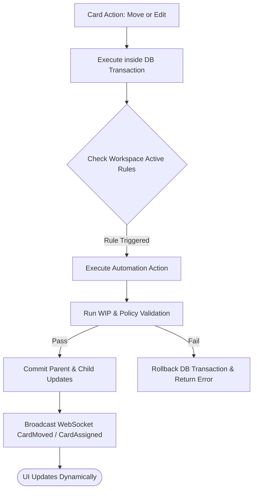

# Product Discovery & Strategy: Business Rules Engine & Status Synchronization (v0.8)

**Status**: Proposal | **Version**: 0.8 | **Date**: 2026-06-14
**Authors**: @product-manager, @ux-designer
**Strategic Alignment**: Flow Automation, Context Preservation, Administrative Control, Workspace Security, and Reduced Manual Overhead.

---

> [!NOTE]
> This document details the strategic discovery, personas, Jobs-to-be-Done (JTBD) user stories, and interactive flow specifications for implementing the **Business Rules Engine (IFTTT status sync)** in Kanbrio. Building upon the 2D Layout (v0.1), Workspace Isolation (v0.2), and Task Hierarchy (v0.7), this feature automates board transitions (e.g. automatically moving a parent card when all children are finished or auto-assigning a card on column entry) to optimize lead times and eliminate manual status-chasing.

---

## 👥 Part 1: Product Strategy & Rationale

As Kanbrio scales to support complex enterprise projects, manually managing state transitions across multiple sub-levels becomes a tedious chore that introduces human error. If developers forget to update parent tasks when completing child tasks, project progress metrics stall, and project managers waste time verifying work status. Conversely, building rigid, hard-coded rules into the core controller limits customization for teams with different workflow maturities.

Our objective is to introduce a lightweight, extensible **Business Rules Engine** that supports trigger-action configurations ("If This Then That" / IFTTT) scoped strictly to workspace boundaries.

We evaluated three strategic paths for the automation engine:

### 1.1 Strategic Paths Evaluated

*   **Path A: Hard-coded Automation Rules**
    *   *Mechanism*: Write static backend hooks directly in the card controller (e.g., hard-code that completing children always moves parent to done).
    *   *Pros*: Fast to implement; no DB schema additions for rules; minimal API overhead.
    *   *Cons*: Rigid; cannot be customized or turned off per workspace; cannot support other rule types (e.g., auto-assign).
*   **Path B: General metadata-driven IFTTT engine (The Selected Path)**
    *   *Mechanism*: A database table `business_rules` that maps general trigger types (`child_status_changed`, `card_moved`) and action types (`move_card`, `assign_card`) using JSONB configurations.
    *   *Pros*: Highly extensible; clean abstraction; allows admins to customize rules; scales to support complex operations (e.g., webhooks, Slack alerts) in the future.
    *   *Cons*: Requires a dedicated DB migration, query layer, and UI settings page.
*   **Path C: External Workflow Orchestrator Integration**
    *   *Mechanism*: Delegate automation to external tools (n8n, Zapier) using webhooks and REST APIs.
    *   *Pros*: Offloads logic from the core application; allows connecting with third-party tools.
    *   *Cons*: High setup friction for users; introduces external latency; breaks the low-latency single-page-app experience.

### 1.2 Automation Flow Architecture

---

## 🧑‍🤝‍🧑 Part 2: Primary Personas

We define our business rules engine around three primary personas:

### 2.1 The Scrum Master / Agile Coach ("The Flow Guardian")
*   **Core Need**: Automatic workflow governance. Wants to ensure that cards move through the board correctly (e.g., parent tasks don't get left in "To Do" when coding starts, and work is automatically assigned to the right team members during QA phases).
*   **Pain Point**: Spend too much time cleaning up board states and reminding developers to move their parent cards or assign tasks.
*   **Desired Outcome**: A set-and-forget automation engine that moves and assigns tasks programmatically.

### 2.2 The Developer ("The Focus Executor")
*   **Core Need**: Zero administrative friction. Wants to drag-and-drop a card, check off a checklist, and immediately return to writing code without updating parent statuses or logging assignees manually.
*   **Pain Point**: Frustration with entering metadata or keeping multiple boards in sync.
*   **Desired Outcome**: Invisible automation that updates parent cards and metadata in the background.

### 2.3 The Workspace Administrator ("The Rule Architect")
*   **Core Need**: Clear interface to configure, test, and toggle automations without writing code.
*   **Pain Point**: Complex UI builders or CLI configurations that take hours to debug.
*   **Desired Outcome**: A simple, keyboard-accessible settings tab to toggle standard rules on/off or configure auto-assignments.

---

## 🎯 Part 3: Jobs-to-be-Done (JTBD) User Stories

### US1: Configurable Business Rules Schema & Transactional Engine
*   **JTBD**: When I configure automated rules in my workspace, I want the system to store them in a secure database structure and execute them transactionally during card movement events, so that the workflows are automatically updated with zero human intervention and no database corruption.
*   **Acceptance Criteria**:
    *   **AC1.1**: The database must enforce a `business_rules` schema scoping workspace boundaries: `id` (UUID), `workspace_id` (UUID), `name` (TEXT), `trigger_type` (VARCHAR), `trigger_config` (JSONB), `action_type` (VARCHAR), `action_config` (JSONB), `is_active` (BOOLEAN), and standard timestamps.
    *   **AC1.2**: Rules must execute inside the same database transaction as the original card movement. If an automation action fails (e.g., due to a WIP limit violation on the parent column), the entire transaction must rollback, returning a specific validation error to the client.
    *   **AC1.3**: The engine must enforce a recursion depth limit (e.g., maximum 5 nested triggers) to prevent infinite loops (e.g., rule A triggers rule B, which triggers rule A).
    *   **AC1.4**: Automatic movements must write to the `card_transitions` audit table with the transition type `system_auto_move` and metadata detailing the triggering rule.

### US2: Auto-Propagation of Status from Children to Parent (Status Sync)
*   **JTBD**: When I progress subtasks on the board, I want the parent card's status to automatically sync (e.g., parent moves to 'In Progress' when first child starts, parent moves to 'Done' when all children are finished), so that project tracking is kept accurate without manual updates.
*   **Acceptance Criteria**:
    *   **AC2.1**: The engine must support the trigger `child_status_changed`.
    *   **AC2.2**: *In-Progress Sync Rule*: If a child card transitions from a To Do/Backlog column to an In Progress column, and the parent card is in a To Do column, the parent card must automatically move to the first In Progress column.
    *   **AC2.3**: *Done Sync Rule*: If a child card transitions to a column marked `is_done = true`, the system must query all siblings. If all siblings are completed (i.e. in columns where `is_done = true`), the parent card must automatically move to the Done column.
    *   **AC2.4**: Triggering a status propagation must broadcast a WebSocket `CardMoved` event to update all active clients.

### US3: Auto-Assignment on Column Entry
*   **JTBD**: When a card enters a specific column of our workflow (such as 'Code Review' or 'QA Testing'), I want the system to automatically assign it to a designated user (or clear the assignee), so that handoffs are smooth and team members receive immediate notification.
*   **Acceptance Criteria**:
    *   **AC3.1**: The engine must support the trigger `card_entered_column` checking target `column_id`.
    *   **AC3.2**: The engine must support the action `assign_card` with `user_id` parameter (or `clear_assignee`).
    *   **AC3.3**: The assignment action must validate that the target user's WIP limit is not exceeded, raising a `409 Conflict` (WipLimitExceeded) error if violated.
    *   **AC3.4**: A WebSocket event `CardMoved` (containing the updated `assigned_user_id`) must broadcast to all clients.

### US4: Admin Settings Interface for Rules Management
*   **JTBD**: When I am managing a workspace, I want an elegant, keyboard-accessible screen to view, create, toggle, and delete automated business rules, so that I can easily customize workflow automation without writing code.
*   **Acceptance Criteria**:
    *   **AC4.1**: Access to the Workspace Rules settings page (route: `/workspaces/:workspace_id/settings/rules`) is restricted to Workspace Admins (returns `403 Forbidden` for standard members).
    *   **AC4.2**: The interface must list all active and inactive rules in a dense, scannable table/list, conforming to standard design system tokens in `DESIGN.md`.
    *   **AC4.3**: Toggling a switch next to a rule must call PATCH `/api/workspaces/:workspace_id/rules/:rule_id` to enable/disable it.
    *   **AC4.4**: A "Create Rule" modal must be fully keyboard accessible (focus trapped, Escape to close, Enter to submit) and allow configuring triggers (e.g. drop-down for columns) and actions.
    *   **AC4.5**: During backend execution, inputs are disabled, showing a loading shimmer and/or spinner. On success, a success toast is shown in the bottom right corner.

---

## 🎨 Part 4: Interactive & UX Specifications

### 4.1 UI Component Specifications
*   **Workspace Rules Route**: Integrated as a sidebar settings tab `/workspaces/:workspace_id/settings/rules`.
*   **Rules List Card**: Size: `w-full p-4 bg-surface border border-base rounded-lg shadow-sm flex items-center justify-between`. Shows:
    *   Rule Title and Description.
    *   Status Badge (`Active` / `Inactive`).
    *   Switch toggle component.
*   **Create Rule Modal**: Overlay matching `docs/product/onboarding_user_stories.md` standards. Features a two-step wizard:
    *   *Step 1: Choose Trigger* (Dropdown: Card Moved, Child Status Changed).
    *   *Step 2: Choose Action* (Dropdown: Move Parent, Assign to User).

### 4.2 Playwright Test Anchors (`data-testid`)
*   Rules Settings Sidebar Link: `data-testid="sidebar-settings-rules"`
*   Rules Settings Container: `data-testid="rules-settings-container"`
*   Rule Row: `data-testid="rule-row-{rule_id}"`
*   Rule Toggle: `data-testid="rule-toggle-{rule_id}"`
*   Add Rule Trigger Button: `data-testid="add-rule-button"`
*   Rule Type Select: `data-testid="rule-type-select"`
*   Rule Action Select: `data-testid="rule-action-select"`
*   Rule Form Submit: `data-testid="rule-submit-button"`

---

## 📊 Part 5: RICE Prioritization

| Issue / Feature Component | Reach (1-10) | Impact (0.5-3) | Confidence (50%-100%) | Effort (Person-Weeks) | RICE Score | MoSCoW |
| :--- | :--- | :--- | :--- | :--- | :--- | :--- |
| **Database Schema & Migrations (US1)** | 10 (All rules) | 2.0 (High) | 95% (Standard pg) | 0.2 | **950** | **Must Have** |
| **Core Rules Engine Logic (US1)** | 10 (All users) | 2.0 (High value) | 90% (Rust transaction) | 0.6 | **300** | **Must Have** |
| **Child-Parent Status Sync Rule (US2)** | 10 (All users) | 2.0 (High value) | 90% (Clear logic) | 0.5 | **360** | **Must Have** |
| **Auto-Assignment Rules (US3)** | 8 (Advanced teams) | 1.5 (Medium value) | 90% (Clear path) | 0.4 | **270** | **Should Have** |
| **REST API for Admin Rules CRUD (US4)** | 10 (All admins) | 1.5 (High) | 95% (Standard REST) | 0.4 | **356** | **Must Have** |
| **Frontend Settings Interface (US4)** | 8 (Admins only) | 1.5 (High value) | 90% (SolidJS forms) | 0.6 | **180** | **Should Have** |
| **WebSocket Sync & Integration Tests** | 10 (All users) | 1.5 (High) | 90% (E2E validated) | 0.5 | **270** | **Must Have** |

**Verdict**: The database migrations, core rules engine logic, child-parent status sync rules, REST API for CRUD, and integration testing/WebSocket updates are classified as **Must Haves** to establish the core automation capability. The Auto-Assignment rules and the visual settings UI page are classified as **Should Haves** that will complete the comprehensive cycle requirements.
