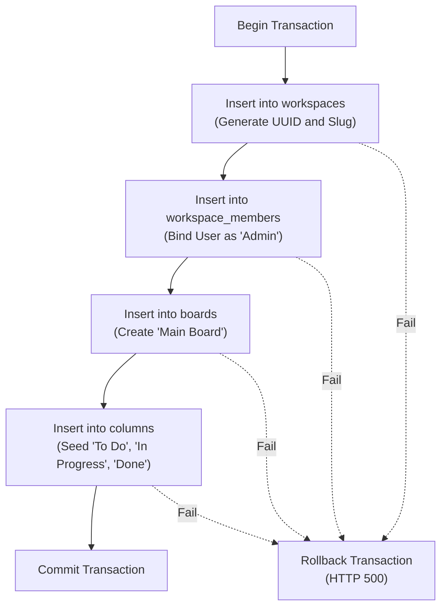

# Technical Specification & Mini-PRD: Onboarding & Workspace Creation (Phase 3)

**Status**: Approved | **Version**: 1.0 | **Owner**: @product-manager | **Date**: 2026-05-30
**Strategic Alignment**: Onboarding Activation, Core User Retention, Concurrency Safety, and Accessibility (a11y) Compliance.

---

> [!IMPORTANT]
> This technical specification builds directly upon the product discovery documented in [Onboarding & Workspace Creation User Stories](onboarding_user_stories.md) and translates the visual guidelines defined in Sections 10 and 11 of `DESIGN.md` into concrete API schemas, database transaction parameters, and strict Acceptance Criteria. This serves as the implementation blueprint for the development team under Test-Driven Development (TDD).

---

## ⚙️ 1. Numbered Functional Requirements (FR)

To resolve the onboarding blocker and ensure robust manual workspace creation and automatic provisioning, the frontend and backend must strictly satisfy the following functional specifications:

### 1.1 Dialog Layout, Focus, & Accessibility (a11y)
*   **FR-31 (Backdrop Fade & Modal Pop Animations)**:
    *   Triggering the manual creation flow must render a backdrop overlay that transitions to `opacity-100` via the `animate-backdrop-fade-in` animation (300ms ease-standard).
    *   The dialog panel card must pop scale-up in the viewport center via the `animate-modal-pop` keyframes (300ms elastic M3 scale).
*   **FR-32 (Programmatic Autofocus)**:
    *   Upon dialog mount, the focus state MUST be programmatically set to the `Workspace Name` input field within 50ms to enable immediate typing.
*   **FR-33 (Keyboard Focus Trap)**:
    *   Focus MUST be trapped inside the modal container. Tabbing past the final actionable element (`Submit` button) must wrap focus back to the first interactive element (`Cancel` or `Close` button/input). Shift-tabbing from the first element must wrap to the last.
*   **FR-34 (Dismissal Actions & Focus Restoral)**:
    *   Pressing the `Escape` key, clicking the backdrop overlay (outside the modal card), or clicking the `Cancel` button must immediately dismiss the dialog.
    *   Upon dismissal, focus MUST be programmatically restored back to the trigger button (`data-testid="create-workspace-button"`) to prevent focus loss.

### 1.2 Form Validation & Error States
*   **FR-35 (Client-Side Input Sanitization)**:
    *   The form input must enforce: (1) Trimmed whitespace from start and end, (2) Length constraint of `1` to `50` characters, and (3) Rejection of empty values.
*   **FR-36 (Validation Feedback & Form Shake)**:
    *   If the user submits invalid input or the server returns validation errors, the dialog container MUST trigger a horizontal wobble via `animate-shake` (300ms cubic-bezier).
    *   The input border must highlight in `border-status-blocked` (#EF4444) and an error text message must display below the field (`data-testid="workspace-modal-error"`) formatted in `text-status-blocked`.
*   **FR-37 (API Network Loading State)**:
    *   During execution of the POST request, the input field, `Cancel` button, and `Submit` button must be marked as `disabled` and `aria-disabled="true"`.
    *   The Submit button text must replace its icon or render adjacent to a high-performance spinner (`animate-spin w-4 h-4 border-2 border-current border-t-transparent rounded-full`).

### 1.3 Toast Notifications & Resiliency Policies
*   **FR-38 (Redirection Success Toast)**:
    *   Upon successful creation, the modal must close immediately, showing a transient success toast at the bottom right viewport corner for 3 seconds before auto-dismissal.
    *   Toast container: `bg-surface border-status-done border-l-4 shadow-xl p-4 rounded-md text-sm font-medium text-primary`.
*   **FR-39 (SRE Timeout & Retry Resiliency)**:
    *   The client network adaptor must enforce a **5-second timeout** on the workspace creation API call to prevent hung requests.
    *   For transient server errors (HTTP statuses `502 Bad Gateway`, `503 Service Unavailable`, `504 Gateway Timeout`), the adapter must execute up to **3 automated retries** with exponential backoff (e.g., 500ms, 1000ms, 2000ms).
    *   If retries are exhausted or a persistent error (`500 Internal Server Error`) occurs, the client must trigger the shake animation, display an error banner inside the modal, and restore input interactivity.

### 1.4 Registration Auto-Provisioning Flow
*   **FR-40 (Zero-Friction Signup Seeding)**:
    *   The user registration pipeline (POST `/api/auth/register` and OAuth signup callback) must intercept successful user registration.
    *   Before returning the authenticated session context, the server must automatically provision a default workspace named `"My Workspace"` and register the new user as `'Admin'`.
*   **FR-41 (Direct Client Redirect Routing)**:
    *   The registration response payload must return the pre-provisioned `workspace_id`.
    *   The client application must catch this ID and bypass the empty state, routing the user directly to `/workspaces/:workspace_id/board` with standard top-edge shimmer loading transitions (`data-testid="workspace-switching-shimmer"`).

---

## 🌐 2. REST API Contract: `POST /api/workspaces`

### 2.1 Route Mapping & Security Middlewares
*   **Method**: `POST`
*   **Path**: `/api/workspaces`
*   **Security Guard**: Session validation middleware via `TenantGuard`. Enforces HTTPOnly, secure, Lax session cookies. Returns `401 Unauthorized` if session token is missing, invalid, or expired.
*   **Headers**:
    *   `Content-Type`: `application/json`

### 2.2 Request Payload JSON Schema
```json
{
  "$schema": "http://json-schema.org/draft-07/schema#",
  "title": "CreateWorkspaceRequest",
  "type": "object",
  "properties": {
    "name": {
      "type": "string",
      "minLength": 1,
      "maxLength": 50,
      "description": "The name of the new workspace. Leading/trailing whitespace will be stripped automatically before persistence."
    }
  },
  "required": ["name"],
  "additionalProperties": false
}
```

### 2.3 Success Response (HTTP `201 Created`)
*   **Body Schema (JSON)**:
```json
{
  "id": "b3e9a7e6-12c4-4b55-a0c5-00c500000001",
  "name": "My Workspace",
  "slug": "my-workspace-b3e9a7e6",
  "created_at": "2026-05-30T17:20:00Z",
  "updated_at": "2026-05-30T17:20:00Z"
}
```

### 2.4 Error Response Body Structures

#### A. Validation Failures (HTTP `400 Bad Request`)
Returned when the name parameter is missing, empty, or exceeds 50 characters.
```json
{
  "code": "VALIDATION_FAILED",
  "message": "Workspace name must be between 1 and 50 characters.",
  "details": {
    "name": ["Must contain at least 1 non-whitespace character.", "Maximum allowed length is 50 characters."]
  }
}
```

#### B. Unauthorized Access (HTTP `401 Unauthorized`)
Returned when session cookie validation fails.
```json
{
  "code": "UNAUTHORIZED",
  "message": "Authentication session has expired or is missing. Please log in again."
}
```

#### C. Database/Timeout Failures (HTTP `500 Internal Server Error`)
Returned on transactional rollbacks, seeding timeouts, or query failures.
```json
{
  "code": "INTERNAL_SERVER_ERROR",
  "message": "An unexpected error occurred while provisioning your workspace. Please try again."
}
```

---

## 💾 3. Database Integrations & Seeding DDL

To ensure absolute multi-tenant boundary safety and prevent partial state insertions (such as a workspace being created without default boards or membership bindings), the creation process must execute within a **single PostgreSQL transaction (`BEGIN ... COMMIT`)**.

### 3.1 DDL Schema Reference

```sql
-- Migration: Add Workspace and Seeding Relations
-- Filename: apps/api/migrations/20260530000000_workspace_seeding.sql

CREATE TABLE IF NOT EXISTS workspaces (
    id UUID PRIMARY KEY DEFAULT gen_random_uuid(),
    name VARCHAR(50) NOT NULL,
    slug VARCHAR(100) NOT NULL UNIQUE,
    created_at TIMESTAMP WITH TIME ZONE NOT NULL DEFAULT NOW(),
    updated_at TIMESTAMP WITH TIME ZONE NOT NULL DEFAULT NOW()
);

CREATE TABLE IF NOT EXISTS workspace_members (
    workspace_id UUID REFERENCES workspaces(id) ON DELETE CASCADE,
    user_id UUID REFERENCES users(id) ON DELETE CASCADE,
    role VARCHAR(20) NOT NULL DEFAULT 'Member',
    wip_limit INT,
    created_at TIMESTAMP WITH TIME ZONE NOT NULL DEFAULT NOW(),
    updated_at TIMESTAMP WITH TIME ZONE NOT NULL DEFAULT NOW(),
    PRIMARY KEY (workspace_id, user_id),
    CONSTRAINT chk_wip_limit CHECK (wip_limit > 0)
);

CREATE TABLE IF NOT EXISTS boards (
    id UUID PRIMARY KEY DEFAULT gen_random_uuid(),
    workspace_id UUID NOT NULL REFERENCES workspaces(id) ON DELETE CASCADE,
    name VARCHAR(100) NOT NULL,
    created_at TIMESTAMP WITH TIME ZONE NOT NULL DEFAULT NOW(),
    updated_at TIMESTAMP WITH TIME ZONE NOT NULL DEFAULT NOW()
);

CREATE TABLE IF NOT EXISTS columns (
    id UUID PRIMARY KEY DEFAULT gen_random_uuid(),
    board_id UUID NOT NULL REFERENCES boards(id) ON DELETE CASCADE,
    name VARCHAR(50) NOT NULL,
    position DOUBLE PRECISION NOT NULL,
    is_done BOOLEAN NOT NULL DEFAULT FALSE,
    created_at TIMESTAMP WITH TIME ZONE NOT NULL DEFAULT NOW(),
    updated_at TIMESTAMP WITH TIME ZONE NOT NULL DEFAULT NOW()
);
```

### 3.2 Transaction Boundary Execution Blueprint

The database service tier must chain the following operations sequentially inside a Rust `sqlx::Transaction`:



#### SQL Seeding Directives (Step 4):
```sql
-- 1. Insert Workspace
INSERT INTO workspaces (id, name, slug, created_at, updated_at)
VALUES ($1, $2, $3, NOW(), NOW());

-- 2. Bind User as Admin
INSERT INTO workspace_members (workspace_id, user_id, role, created_at, updated_at)
VALUES ($1, $4, 'Admin', NOW(), NOW());

-- 3. Create Default Board
INSERT INTO boards (id, workspace_id, name, created_at, updated_at)
VALUES ($5, $1, 'Main Board', NOW(), NOW());

-- 4. Seed Workflow Columns (To Do, In Progress, Done)
INSERT INTO columns (id, board_id, name, position, is_done, created_at, updated_at)
VALUES
(gen_random_uuid(), $5, 'To Do', 1.0, false, NOW(), NOW()),
(gen_random_uuid(), $5, 'In Progress', 2.0, false, NOW(), NOW()),
(gen_random_uuid(), $5, 'Done', 3.0, true, NOW(), NOW());
```

---

## 🧪 4. TDD & E2E Integration Blueprint

### 4.1 Rust Integration Test (`apps/api/tests/workspace_creation_tests.rs`)
Ensures transactional seeding boundaries, validation rules, and role associations are verified under TDD:

```rust
#[tokio::test]
async fn test_transactional_workspace_creation_and_seeding() {
    let test_db = TestDb::new().await;
    let pool = test_db.pool();

    // 1. Seed user session
    let user_id = test_db.create_user("founder@kanbrio.io", "Founder").await;

    // 2. Execute Workspace Creation Service
    let new_ws = Workspace::create_and_seed(
        pool,
        user_id,
        "Kanbrio Startup".to_string()
    )
    .await
    .unwrap();

    // Assert Workspace exists with correct details and slug mapping
    assert_eq!(new_ws.name, "Kanbrio Startup");
    assert!(new_ws.slug.starts_with("kanbrio-startup"));

    // 3. Verify Admin Membership Binding
    let member: (String,) = sqlx::query_as(
        "SELECT role FROM workspace_members WHERE workspace_id = $1 AND user_id = $2"
    )
    .bind(new_ws.id)
    .bind(user_id)
    .fetch_one(pool)
    .await
    .unwrap();
    assert_eq!(member.0, "Admin");

    // 4. Verify Default Board Creation
    let board: (Uuid, String) = sqlx::query_as(
        "SELECT id, name FROM boards WHERE workspace_id = $1"
    )
    .bind(new_ws.id)
    .fetch_one(pool)
    .await
    .unwrap();
    assert_eq!(board.1, "Main Board");

    // 5. Verify Column Seeding (To Do, In Progress, Done)
    let seeded_cols: Vec<(String, f64, bool)> = sqlx::query_as(
        "SELECT name, position, is_done FROM columns WHERE board_id = $1 ORDER BY position ASC"
    )
    .bind(board.0)
    .fetch_all(pool)
    .await
    .unwrap();

    assert_eq!(seeded_cols.len(), 3);
    assert_eq!(seeded_cols[0], ("To Do".to_string(), 1.0, false));
    assert_eq!(seeded_cols[1], ("In Progress".to_string(), 2.0, false));
    assert_eq!(seeded_cols[2], ("Done".to_string(), 3.0, true));
}
```

### 4.2 Playwright Accessibility & Redirection Test (`apps/e2e/tests/workspace_a11y.spec.ts`)
Verifies focus trap, keyboard input constraints, and transition redirects:

```typescript
import { test, expect } from '@playwright/test';

test.describe('Workspace Creation Dialog Accessibility and Redirection Flow', () => {
  test('should enforce focus trap, keyboard inputs, and redirect on success', async ({ page }) => {
    // 1. Authenticate and land on empty state page
    await page.goto('/auth/setup-workspace');

    // 2. Verify empty-state elements are present
    const triggerBtn = page.locator('[data-testid="create-workspace-button"]');
    await expect(triggerBtn).toBeVisible();

    // 3. Click to open modal and verify autofocus
    await triggerBtn.click();
    const modal = page.locator('[data-testid="create-workspace-dialog"]');
    await expect(modal).toBeVisible();

    const nameInput = page.locator('[data-testid="workspace-name-input"]');
    await expect(nameInput).toBeFocused();

    // 4. Verify Focus Trap (Tabbing should wrap back to input)
    await page.keyboard.press('Tab'); // Cancel button
    await page.keyboard.press('Tab'); // Submit button
    await page.keyboard.press('Tab'); // Wrap back to Name Input
    await expect(nameInput).toBeFocused();

    // 5. Test Escape key dismissal
    await page.keyboard.press('Escape');
    await expect(modal).not.toBeVisible();
    await expect(triggerBtn).toBeFocused(); // Focus restored to trigger

    // 6. Reopen and test field validation length error (too long name)
    await triggerBtn.click();
    await nameInput.fill('A'.repeat(51));
    await page.keyboard.press('Enter');

    // Verification error displays and modal shakes
    const errorBanner = page.locator('[data-testid="workspace-modal-error"]');
    await expect(errorBanner).toBeVisible();
    await expect(errorBanner).toContainText('Maximum allowed length is 50 characters');
    await expect(modal).toHaveClass(/animate-shake/);

    // 7. Successful creation and redirection
    await nameInput.fill('Acme Corp Software');
    await page.keyboard.press('Enter');

    // Verify loading overlay and spinner
    const submitBtn = page.locator('[data-testid="workspace-modal-submit"]');
    await expect(submitBtn).toBeDisabled();
    await expect(submitBtn).toHaveAttribute('aria-disabled', 'true');
    await expect(nameInput).toBeDisabled();

    // Redirection successfully transitions to board page
    await page.waitForURL(/\/workspaces\/[0-9a-f\-]+\/board/);
    await expect(page.locator('[data-testid="workspace-switching-shimmer"]')).not.toBeVisible();
  });
});
```

---

This finishes the Technical Specification and Mini-PRD documentation, fully preparing the development team for complete and robust implementation under test-driven engineering frameworks.
