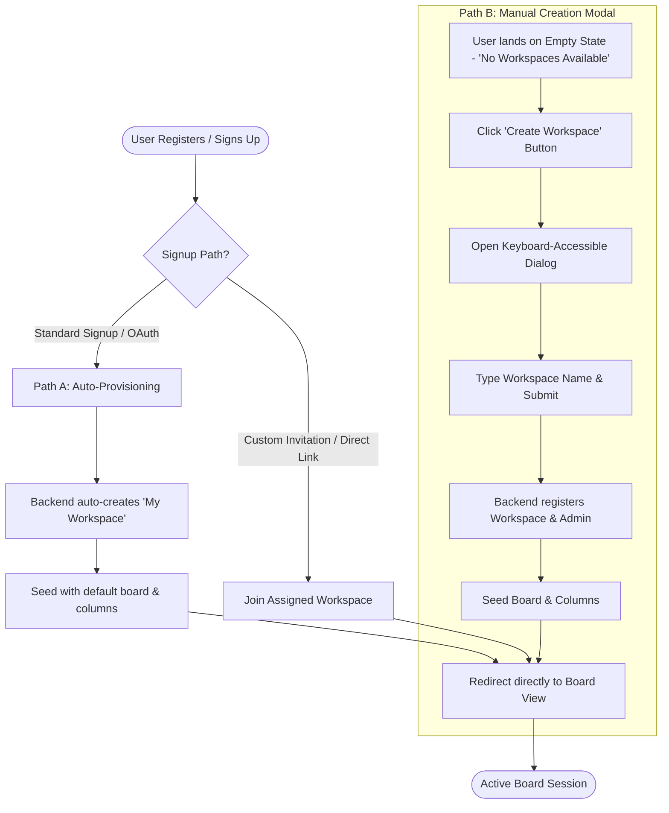

# Product Discovery & Strategy: Onboarding & Workspace Creation Flow (Phase 1)

**Status**: Approved | **Version**: 1.0 | **Date**: 2026-05-30
**Authors**: @product-manager, @ux-designer
**Strategic Alignment**: Onboarding Activation, Core User Retention, Concurrency Safety, and Accessibility (a11y) Compliance.

---

> [!NOTE]
> This document details the strategic discovery, personas, Jobs-to-be-Done (JTBD) user stories, and interactive flow specifications for resolving the onboarding blocker in Kanbrio. A newly registered user gets stuck on the 'No Workspaces Available' screen because the 'Create Workspace' button in `WorkspaceSelector.tsx` is currently a dead, non-interactive element.

---

## 👥 Part 1: Product Strategy & Rationale

We analyzed two strategic paths to resolve the workspace creation blocker and maximize user activation:

### 1.1 Strategic Paths Evaluated

*   **Path A: Zero-friction Auto-provisioning**
    *   *Mechanism*: Automatically create a default workspace (e.g. "My Workspace") upon sign-up, assign the user as `Admin`, and direct them straight into it.
    *   *Pros*: Eliminates 100% of cognitive load and setup friction during signup. Maximizes immediate time-to-value (TTV) and user activation.
    *   *Cons*: Bypasses personalization; generates generic "My Workspace" database entries that may go abandoned if the user doesn't engage.
*   **Path B: Manual Creation Modal**
    *   *Mechanism*: Display an elegant, keyboard-accessible dialog prompt to name their first workspace.
    *   *Pros*: High initial engagement and emotional ownership by having the user name their space. Reusable UI components across the product.
    *   *Cons*: Introduces immediate friction; requires text input right after authentication; increases risk of drop-off if the user is lazy or the flow feels cumbersome.

### 1.2 The Formal Decision: The Unified Hybrid Onboarding Strategy

To capture the benefits of both paths and eliminate all critical blockers, Kanbrio adopts a **Hybrid Onboarding & Workspace Recovery Strategy**:

#### Strategic Rationale:
1.  **Guaranteed Activation (Path A as Default)**: 95% of new users signing up via OAuth or credentials will undergo **Auto-Provisioning**. They will never see the empty state. Instead, the backend automatically provisions a workspace named `"My Workspace"`, assigns them as the `Admin`, seeds a default board, and logs them directly into the board view. **Time-to-Value is minimized.**
2.  **Interactive Fallback (Path B as Safety Net)**: If a user somehow lands in an empty state (e.g., they voluntarily leave or delete all their workspaces, or their initial invitation fails to bind), they see the "No Workspaces Available" screen. The dead "Create Workspace" button will trigger a **Manual Workspace Creation Modal**. This ensures the user is never trapped in a dead-end loop.
3.  **Code Reusability**: The manual workspace creation dialog designed for the empty state recovery will be reused as the generic workspace creation modal accessible from the active Workspace Selector dropdown, satisfying subsequent creation requirements.

---

## 👥 Part 2: Primary Personas

We target three core personas whose onboarding experience and administrative control define our workspace strategy:

### 2.1 The Solo Creator (New Admin)
*   **Core Need**: Immediate hands-on testing. Wants to explore the board's mechanics, dense 2D layouts, and speed without doing chores.
*   **Pain Point**: Getting stuck on a blank screen or being forced to fill in extensive metadata forms before seeing a card.
*   **Desired Outcome**: 0-friction direct redirect to a pre-populated workspace with a "Main Board" ready to receive tasks.

### 2.2 The Team Collaborator (Invited Member)
*   **Core Need**: Simple onboarding to join their organization's existing boards.
*   **Pain Point**: Administrative delays where they sign up but their workspace invitation hasn't processed, leaving them stranded in a dead-end UI with no way out.
*   **Desired Outcome**: Clear instructions and an immediate fallback to spin up a private sandbox workspace while their team invitations resolve.

### 2.3 The Agile Coordinator (The Re-creator)
*   **Core Need**: Administrative flexibility. Needs to create separate workspaces for different client projects or spin up fresh environments.
*   **Pain Point**: Being unable to easily create multiple workspaces or becoming stranded in a broken interface when migrating between empty workspaces.
*   **Desired Outcome**: A fast, keyboard-accessible dialog to provision new isolated tenants in seconds.

---

## 📝 Part 3: Jobs-to-be-Done (JTBD) User Stories

### US1: Zero-Friction Workspace Auto-Provisioning
*   **JTBD**: When I successfully register a new account on Kanbrio, I want the system to automatically provision a default workspace named "My Workspace" and direct me straight into it, so I can start organizing my projects with zero initial configuration friction.
*   **Acceptance Criteria**:
    *   **AC1.1**: The registration endpoint (`/api/auth/register` and OAuth signup sequence) must trigger a transactional workspace creation hook.
    *   **AC1.2**: The automatically created workspace must be named `"My Workspace"`.
    *   **AC1.3**: The registering user must be assigned the `'Admin'` role within this workspace.
    *   **AC1.4**: The workspace must be seeded with a default board (named `"Main Board"`) and three standard workflow columns: `"To Do"`, `"In Progress"`, and `"Done"`.
    *   **AC1.5**: Upon successful registration, the login flow must automatically fetch this active workspace and route the user to `/workspaces/:workspace_id/board`.

### US2: Empty-State Manual Workspace Creation Dialog (Path B)
*   **JTBD**: When I have no active workspaces and land on the empty-state screen, I want to click the "Create Workspace" button and name my new workspace in an accessible modal dialog, so I can quickly create a new project environment and exit the blocker screen.
*   **Acceptance Criteria**:
    *   **AC2.1**: Clicking the `"Create Workspace"` button in `WorkspaceSelector.tsx` must trigger an overlay modal dialog.
    *   **AC2.2**: The modal must be fully keyboard-accessible:
        *   Focus must be trapped inside the modal when active.
        *   Pressing `Escape` or clicking the backdrop overlay must close the modal.
        *   Pressing `Enter` within the input field must submit the form.
    *   **AC2.3**: The modal must include a single, validated text input field for the **Workspace Name**:
        *   Field must be autofocused upon modal open.
        *   Validation: Must be non-empty, stripped of leading/trailing whitespace, and contain a maximum of 50 characters.
        *   Show an active validation error badge if input is invalid.
    *   **AC2.4**: Submitting the form must trigger a POST request to `/api/workspaces` with the payload `{ name: workspace_name }`.
    *   **AC2.5**: During network execution, the modal input and buttons must transition to a loading state (disabled, showing a high-performance spinner and `aria-disabled="true"`).
    *   **AC2.6**: On success, a bottom-right success toast is shown, the modal closes, the workspace is seeded, and the client transitions to the board.
    *   **AC2.7**: On network failure, the modal remains open, a shake animation (`animate-shake`) is applied to the modal container, and an error banner is displayed with clear feedback.

### US3: Backend Workspace Seeding & Tenant Security Guard
*   **JTBD**: When a workspace is created (either automatically during sign-up or manually via the dialog), I want the system to securely initialize it with isolated tenant boundaries, so my team's private boards are completely protected from other users.
*   **Acceptance Criteria**:
    *   **AC3.1**: The creation sequence must execute in a database transaction (`BEGIN ... COMMIT`). If column or board seeding fails, the workspace and user membership must be fully rolled back.
    *   **AC3.2**: The user's role in the new workspace must be written to the `workspace_members` table as `'Admin'`.
    *   **AC3.3**: Access control checks (`TenantGuard` on the backend) must ensure that only active members of a workspace can query, write, or update its cards, columns, or settings, returning `403 Forbidden` for tenant crossings.

---

## 🎨 Part 4: Interactive & UX Specifications

### 4.1 Dialog UI Specs & Accessibility Guidelines (`DESIGN.md` compliance)
*   **Modal Panel Structure**: Centered relative to the viewport. Size: `w-full max-w-[440px] p-6 bg-surface border border-base rounded-lg shadow-xl flex flex-col gap-5`.
    *   *Dark Mode*: `dark:bg-slate-900 dark:border-slate-800 dark:shadow-2xl`.
*   **Backdrop Overlay**: `fixed inset-0 bg-black/40 backdrop-blur-sm z-40 transition-opacity duration-300 ease-standard`.
*   **Focus Management**: Focus must be immediately placed on the "Workspace Name" input. Focus trap must prevent `Tab` navigation from leaking outside the modal.
*   **ARIA Landmarks**:
    *   Container must declare `role="dialog"`, `aria-modal="true"`, and `aria-labelledby="modal-title"`.
    *   Close button must declare `aria-label="Close dialog"`.

### 4.2 State Variations & Keyframe Animations
*   **Loading State**:
    *   Input: `disabled bg-elevated text-secondary cursor-not-allowed`.
    *   Submit Button: `bg-accent-primary/60 cursor-wait flex items-center gap-2 justify-center`. Renders an inline white spinner (`border-t-transparent animate-spin`).
*   **Error State**:
    *   Input border: `border-status-blocked bg-status-blocked/5`.
    *   Error Text: Rendered beneath the field: `text-xs text-status-blocked font-medium mt-1`.
    *   Form Shake: On submission failure, trigger the `animate-shake` (300ms horizontal wobble) on the modal card.
*   **Enter/Exit Transition**:
    *   Overlay fades in (`duration-300 ease-standard`).
    *   Modal card uses `animate-dropdown-enter` (150ms scales from 0.95 and translates up slightly).

### 4.3 Playwright Test Anchors (`data-testid`)
To ensure robust integration test coverage, the developer must implement the following selectors:
*   Empty State Container: `data-testid="workspace-empty-state"`
*   Create Button (Trigger): `data-testid="create-workspace-button"`
*   Modal Overlay: `data-testid="create-workspace-modal-overlay"`
*   Dialog Container: `data-testid="create-workspace-dialog"`
*   Workspace Name Input: `data-testid="workspace-name-input"`
*   Cancel Button: `data-testid="workspace-modal-cancel"`
*   Submit Button: `data-testid="workspace-modal-submit"`
*   Error Message Banner: `data-testid="workspace-modal-error"`
