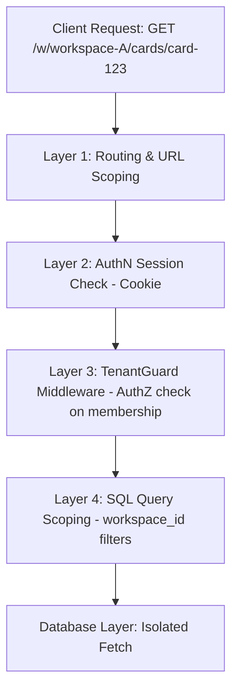
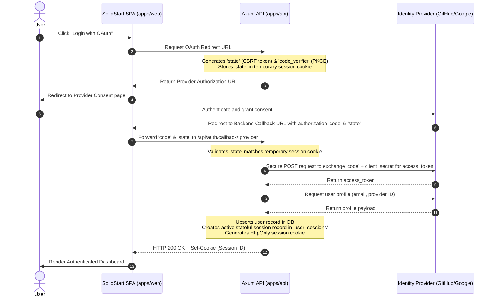

# Product Discovery & Technical Architecture: Core User Authentication (GitHub/Google OAuth & Workspace Isolation)

**Status**: Proposal | **Version**: 0.2 | **Date**: 2026-05-29
**Authors**: @product-manager, @architect, @security
**Strategic Alignment**: Predictability, Strict Tenant Isolation, and Zero-Friction Developer Onboarding.

---

> [!NOTE]
> This document details the product requirements, technical architecture, and preliminary threat model for implementing GitHub/Google OAuth and enforcing strict workspace isolation (multi-tenancy) in Kanbrio. This builds directly upon the skeleton established in the [v0.1 Foundation User Stories](v0.1_user_stories.md) and [v0.1 Mini-PRD](v0.1_mini_prd.md).

---

## 👥 Part 1: Product Discovery & Requirements

### 1.1 Primary Personas

We target three core personas whose security, flow, and onboarding needs define our authentication and isolation strategy:

#### 1.1.1 The Developer (Individual Contributor)
*   **Core Need**: Frictionless onboarding and secure, fast access to tasks without maintaining a new set of credentials.
*   **Pain Point**: Having to create separate usernames/passwords for every tool, causing fatigue and poor password practices.

#### 1.1.2 The Organization Owner (Workspace Admin)
*   **Core Need**: Absolute confidence that proprietary codebase tasks, roadmaps, and audit logs are secure, visible only to authorized personnel, and completely isolated from other tenants.
*   **Pain Point**: Fear of cross-tenant data leakage or horizontal privilege escalation where external users could enumerate internal resources.

#### 1.1.3 The Cross-Functional Collaborator (Agile Coach / Consultant)
*   **Core Need**: The ability to switch contexts between multiple teams or client workspaces fluidly without logging out or re-authenticating.
*   **Pain Point**: Friction in managing multi-team workflows when forced to use separate accounts or manually re-authenticate for different projects.

---

### 1.2 Jobs-to-be-Done (JTBD) User Stories

#### US1: OAuth Sign-In & Automated Account Provisioning
*   **JTBD**: When I sign in to Kanbrio using my corporate GitHub or Google account, I want the system to securely authenticate me and automatically provision my user profile, so I can access my boards immediately without filling out redundant registration forms or maintaining a new password.
*   **Acceptance Criteria**:
    *   **AC1.1**: The login interface must feature distinct "Sign in with GitHub" and "Sign in with Google" OAuth buttons conforming to brand and accessibility guidelines.
    *   **AC1.2**: Upon successful OAuth handshake, if the user's email does not exist in Kanbrio's database, a user record must be atomically created in the `users` table with their email, full name, and avatar URL.
    *   **AC1.3**: Authenticated session state must be stored in a secure, HTTP-only, SameSite=Lax, and Secure cookie containing a cryptographically signed JWT.
    *   **AC1.4**: Failed OAuth attempts (e.g., authorization denied, provider timeout) must gracefully redirect to the login screen with a user-friendly error message, leaving no orphan session states.

#### US2: Active Workspace Selection & Context Switching
*   **JTBD**: When I belong to multiple workspaces, I want to see a clear list of my active workspaces and switch between them dynamically, so I can collaborate with different teams or departments without logging out and back in.
*   **Acceptance Criteria**:
    *   **AC2.1**: The main application interface must display a sidebar dropdown containing only the workspaces where the current user holds an active membership record.
    *   **AC2.2**: Selecting a workspace must dynamically update the application route to `/w/:workspace_id` and refresh the boards, columns, and cards context to match the chosen workspace.
    *   **AC2.3**: The active workspace selection must be persisted in local storage or session cookies so that page refreshes do not reset the user's working context.
    *   **AC2.4**: Navigating to the base path `/` when authenticated must automatically redirect the user to their last active workspace or their oldest active workspace if no last active workspace is recorded.

#### US3: Strict Tenant Isolation & Data Leakage Prevention
*   **JTBD**: When I am working on proprietary boards within my organization's workspace, I want the system to strictly isolate all database queries, API endpoints, and event logs by workspace ID, so I can guarantee that unauthorized external users cannot access, modify, or even discover our data.
*   **Acceptance Criteria**:
    *   **AC3.1**: Every database query for cards, columns, swimlanes, and card transitions MUST include a `workspace_id = <current_workspace_id>` filter or join on a validated membership relation.
    *   **AC3.2**: Global search or direct URL manipulation targeting a resource (e.g., GET `/api/cards/<card_id>`) belonging to a different workspace must fail immediately with a `404 Not Found` error to prevent resource existence enumeration (preventing attackers from guessing UUIDs).
    *   **AC3.3**: Cross-tenant data leakage tests must prove that zero data from Workspace A is returned in queries executed under Workspace B credentials.

#### US4: Secure Workspace Invitation & Membership Flow
*   **JTBD**: When I want to onboard new collaborators to my workspace, I want to generate a secure, single-use, or domain-restricted invitation link, so I can seamlessly join them to our workspace upon their successful authentication through Google/GitHub.
*   **Acceptance Criteria**:
    *   **AC4.1**: Workspace administrators must be able to generate secure, cryptographically signed invitation URLs containing a high-entropy token (`HMAC-SHA256`) with a customizable expiration period (default: 7 days).
    *   **AC4.2**: When an unauthenticated user visits a workspace invitation URL, they must be forced to authenticate via OAuth first, with the invitation context preserved in the session.
    *   **AC4.3**: Upon successful authentication, the system must validate the token, add the user to the workspace's membership list (`workspace_members` table) with the assigned role, and redirect them directly to the workspace's primary dashboard.
    *   **AC4.4**: Once used (for single-use invites) or expired, the system must reject any further join attempts using that link with a clear "Invalid or Expired Invite" message.

---

### 1.3 Numbered Functional Requirements (FR)

These functional requirements implement the value defined in the JTBD stories above and build directly on the existing architecture (continuing from FR8):

#### 1.3.1 OAuth Authentication Engine
*   **FR9**: The system must integration-test OAuth 2.0 flows for both GitHub and Google using standardized client credentials and redirect URIs.
*   **FR10**: The backend must provision a user record atomically within a single database transaction upon successful OAuth callback if the email is not already present.
*   **FR11**: The system must issue a cryptographically signed JWT token stored in a `Set-Cookie` header with the following flags: `HttpOnly`, `Secure`, `SameSite=Lax`, `Path=/`.
*   **FR12**: An API endpoint `GET /api/auth/me` must return the current authenticated user's profile metadata (id, email, name, avatar) or a `401 Unauthorized` response if no valid session exists.

#### 1.3.2 Workspace Isolation and Context Switching
*   **FR13**: The system must provide a `GET /api/workspaces` endpoint returning a JSON array of workspaces of which the user is a member (joining `workspaces` and `workspace_members` tables).
*   **FR14**: The backend API must implement a robust middleware layer (`TenantGuard`) that intercepts every request containing a `:workspace_id` route parameter or `X-Workspace-ID` header, verifying that the authenticated user has an active membership record for that workspace.
*   **FR15**: SQL queries inside repositories must enforce workspace scoping. Example query structure:
    ```sql
    SELECT * FROM cards
    WHERE id = $1 AND workspace_id = $2;
    ```
*   **FR16**: To prevent resource enumeration, the backend must return a standard `404 Not Found` (rather than a `403 Forbidden`) if a requested resource UUID exists in another workspace tenant to which the user does not belong.

#### 1.3.3 Invitation and Membership Management
*   **FR17**: Admins must be able to generate invitation links via `POST /api/workspaces/:workspace_id/invitations` returning a cryptographically unique URL.
*   **FR18**: The system must validate invitations via `GET /api/invitations/validate?token=<token>`. If expired or already consumed, it must return a `400 Bad Request`.
*   **FR19**: Joining a workspace via a valid token must atomically insert a membership row:
    ```sql
    INSERT INTO workspace_members (workspace_id, user_id, role, joined_at)
    VALUES ($1, $2, $3, NOW());
    ```
*   **FR20**: The system must support single-use invitation tokens by marking `used_at` in the `workspace_invitations` table upon successful membership creation, invalidating subsequent uses of the same token.

---

### 1.4 Workspace Isolation Enforcement Mechanics

To ensure enterprise-grade security and compliance with the core zero-leakage promise, isolation is enforced at four distinct levels:



*   **URL-based Scope (Layer 1)**: All frontend and backend endpoints targeting workspace-specific data must be scoped under the workspace identifier (e.g., `/w/:workspace_id/` in the client, and `/api/workspaces/:workspace_id/` in the API). The SolidJS client state scopes all reactive resources to the current route.
*   **Middleware Tenant Verification (Layers 2 & 3)**: Every request targeting a workspace-scoped route must pass through `TenantGuard` middleware. It extracts the authenticated `user_id` from the secure cookie and checks membership:
    ```sql
    SELECT EXISTS (
        SELECT 1 FROM workspace_members
        WHERE workspace_id = $1 AND user_id = $2
    );
    ```
*   **Query-Level Workspace Scoping (Layer 4)**: All database interactions within the repository layer must require a `workspace_id` argument to prevent accidental leakage.
*   **Non-Enumeration Policy**: If a queried resource exists but belongs to a different workspace, the system returns `404 Not Found` to prevent UUID brute-forcing.

---

## 🛠️ Part 2: Technical Architecture & Design

### 2.1 JSON Web Tokens (JWT) vs. Private Session Cookies

For a highly collaborative, real-time workspace application like Kanbrio, the session model decision is fundamental to maintaining system integrity.

#### A. Standard Web Security
*   **XSS Protection (Cross-Site Scripting)**: Storing JWTs in client-side storage (`localStorage` or `sessionStorage`) exposes them to immediate theft in the event of an XSS payload execution. In contrast, **Private Session Cookies** configured with `HttpOnly`, `Secure`, and `SameSite` flags are completely inaccessible to browser JavaScript, mitigating the risk of token harvesting.
*   **CSRF Protection (Cross-Site Request Forgery)**: Cookies are automatically attached to matching outgoing requests. While JWTs stored in auth headers are naturally immune to CSRF, cookie CSRF exposure is neutralized in modern browsers using `SameSite=Lax` or `SameSite=Strict`, paired with custom client-sent headers (like `X-Requested-With` or anti-CSRF challenge tokens) that are validated on the backend.
*   **Data Leakage**: JWTs are readable client-side payloads. Opaque session cookies store only a random cryptographically secure string (e.g., `session_3e4f...`), keeping user metadata completely server-side.

#### B. Stateful Session Management & Ease of Revocation
*   **Stateless Revocation Dilemma**: Fully stateless JWTs cannot be instantly invalidated on the server (e.g., in the event of logout, credential rotation, or workspace eviction) without maintaining a stateful blacklist (e.g. in Redis).
*   **Private Session Cookies**: Links to a server-side session table (`user_sessions` or a fast Redis store). Revocation is trivial: the server deletes the session record, instantly invalidating the cookie on the next request.

#### C. Recommendation for Kanbrio
Kanbrio will use **Private Session Cookies** backed by a server-side session store. This provides standard-compliant XSS security, instant access revocation, and avoids complex token-rotation mechanics in the Single Page Application.

---

### 2.2 Argon2id Hashing for Password Fallback Auth

To support traditional password login alongside OAuth:
*   **Algorithm**: We will use **Argon2id** (the profile recommended by OWASP and winner of the Password Hashing Competition), offering advanced protection against highly parallelized GPU/ASIC offline attacks.
*   **Backend Integration**: Implemented via the `argon2` crate under the `password-hash` abstraction framework.
*   **Non-Blocking Execution**: Password hashing is computationally expensive. To prevent blocking the main asynchronous tokio threads, hashing and verification will run inside `tokio::task::spawn_blocking`.

---

### 2.3 OAuth Flows (GitHub & Google)

The OAuth handshake must be handled entirely server-side (Authorization Code Flow) to keep the `client_secret` confidential:



---

### 2.4 Workspace Isolation Enforcement

*   **Relational Database Mapping**: A `workspace_members` table maps `user_id` and `workspace_id` with associated roles (`admin`, `member`, `viewer`).
*   **Path-Based Middleware Enforcement**: Using Axum's custom **FromRequestParts Extractor** pattern, we define a `WorkspaceContext` extractor. It intercepts routes containing `/api/workspaces/:workspace_id/...`, verifies the membership relation, and injects a type-safe context into request handlers, aborting early with `404 Not Found` if access is denied.

---

### 2.5 Trade-offs

| Choice | Pros | Cons | Discarded Alternative | Rationale for Discarding |
| :--- | :--- | :--- | :--- | :--- |
| **Private Session Cookies (Server-side store)** | - High XSS security via `HttpOnly`. <br>- Instant server-side revocation. <br>- Smaller client-side footprint. | - Requires DB/cache lookup per request. <br>- Susceptible to CSRF (requires SameSite & headers protection). | **JSON Web Tokens (JWT) in LocalStorage** | High risk of XSS token leakage. Highly complex flow required for instant revocation (forces stateless JWTs to become stateful via blacklists). |
| **Argon2id Hashing** | - Standard OWASP recommendation. <br>- Highly resistant to custom GPU/ASIC brute-force attacks. | - Computationally intensive (needs execution on tokio blocking thread pool). | **Bcrypt / PBKDF2** | Weak against highly parallelized custom offline ASIC cracking hardware. |
| **Server-Side Authorization Code Flow** | - `client_secret` is never exposed. <br>- Tokens are exchanged and processed within a secure network environment. | - Extra backend-to-backend network hop on callback (increases latency for login). | **Client-Side OAuth Handling (Implicit Flow)** | High security risk. Exposing short-lived provider access tokens to the client browser increases attack surface and reduces backend lifecycle control. |
| **Path-Based Middleware Enforcement (Axum Extractors)** | - Centralized, declarative router guard. <br>- Simple unit/integration testing. <br>- Injects strongly typed context. | - Developers must remember to add the extractor to all workspace endpoints. | **Row-Level Security (RLS) in PostgreSQL** | Complex connection pooling setup in SQLx (setting session variables like `SET LOCAL user.id` per query is error-prone). Harder to debug and optimize recursive CTE queries. |

---

### 2.6 ADR 005 Skeleton

#### ADR 005: Core User Authentication & Workspace Isolation Model

**Status**: Proposed | **Owner**: @architect

##### Context
Kanbrio is designed to be an enterprise-grade, collaborative flow management tool. Because workspace isolation and flow data safety are paramount, we must guarantee that:
1.  Session management is robust against malicious client-side script execution (XSS).
2.  Active user sessions can be revoked instantly.
3.  Access to project boards, cards, and transitions is strictly limited to authorized workspace members.

##### Decision
We will implement **Private Session Cookies** backed by a server-side PostgreSQL session store for authentication, **Argon2id** for local fallback password hashing, and **Axum Extractors** (path-based router middleware) for workspace isolation.

##### Consequences
*   **Positive**:
    *   No security tokens are exposed to browser JavaScript, eliminating XSS token theft.
    *   Immediate revocation of active sessions on the server side.
    *   Secure backend-to-backend handling of Google and GitHub OAuth handshakes.
    *   Type-safe route-level authorization guards for workspace access.
*   **Negative**:
    *   Every authenticated API request requires a database check to validate the session.
    *   Requires strict CSRF prevention layers (SameSite cookie attributes and custom header checks).
*   **Mitigations**:
    *   Optimize the session database queries with compound indexing.
    *   Require custom headers (e.g. `X-Workspace-ID`) and `SameSite=Lax` cookies for all API calls.

---

### 2.7 Critical Files

#### Rust Backend (`apps/api`)
*   `apps/api/Cargo.toml`: Add authentication dependencies (`argon2`, `rand`, `oauth2`, `cookie`).
*   `apps/api/src/error.rs`: Introduce security error states (`AppError::Unauthorized`, `AppError::Forbidden`, `AppError::OAuthError`).
*   `apps/api/src/lib.rs`: Mount auth handlers, configure CORS credentials, and register middleware.
*   `apps/api/src/handlers/auth.rs` *(New)*: Implement local credentials login, OAuth trigger/callback, and logout.
*   `apps/api/src/models/user.rs` *(New)*: Define `User`, `UserCredential`, and `UserSession` mapped to the database.
*   `apps/api/src/models/workspace.rs` *(New)*: Define workspace layouts and memberships.
*   `apps/api/src/middleware/auth.rs` *(New)*: Implement `AuthenticatedUser` and `WorkspaceContext` extractors.
*   `apps/api/migrations/002_authentication_and_workspaces.sql` *(New)*: Establish tables for users, sessions, credentials, and memberships.

#### Solid.js Frontend (`apps/web`)
*   `apps/web/src/api/auth.ts` *(New)*: Network calls for `/api/auth/login`, `/api/auth/logout`, `/api/auth/me`.
*   `apps/web/src/components/AuthProvider.tsx` *(New)*: Signal-based context (`currentUser`, `activeWorkspace`).
*   `apps/web/src/components/ProtectedRoute.tsx` *(New)*: Route guard that redirects unauthenticated users to `/login`.
*   `apps/web/src/components/Login/Login.tsx` *(New)*: Redirection interface for Google/GitHub.
*   `apps/web/src/App.tsx`: Wrap main SPA in `<AuthProvider>` and dynamically swap mock workspace IDs.

---

## 🔒 Part 3: Preliminary Threat Model & Security Review

### 3.1 Assets, Trust Boundaries, and Threat Actors

*   **Assets**: User Sessions, Workspace Data, OAuth Secrets, User Identifiers (UUIDs).
*   **Trust Boundaries**:
    1.  *Client-Server Boundary (SolidJS Client ↔ Axum API)*: Public internet. Controls: Standard TLS/HTTPS, strict CORS policy, and session cookies.
    2.  *OAuth Provider Boundary (Google/GitHub ↔ Axum Server)*: Controls: Outbound HTTPS call, secure client secret storage.
    3.  *Server-Database Boundary (Axum API ↔ PostgreSQL via SQLx)*: Controls: Network isolation, parameter-bound SQLx queries.
*   **Threat Actors**: Unauthenticated External Attacker, Malicious/Compromised Tenant (Internal User), Compromised Client / XSS Payload.

---

### 3.2 Findings & Threats

#### `[critical]` Workspace Injection & Cross-Tenant Data Leakage via IDOR/BOLA
*   **Description**: Because Axum routing uses paths containing workspace IDs (e.g., `/api/workspaces/:workspace_id/cards/:card_id/move`), an authenticated user from Workspace A could manually construct request paths targeting Workspace B. If the backend fails to verify that the logged-in user possesses valid membership in the requested `workspace_id`, the attacker can retrieve or manipulate cards belonging to other tenants.
*   **Impact**: Severe cross-tenant exposure and data leakage.
*   **Root Cause**: Lack of dynamic workspace-to-user membership checks in endpoint handlers or global routing middleware in the Rust/Axum backend.

#### `[high]` OAuth Login CSRF due to Missing or Weak OAuth State Validation
*   **Description**: If the backend does not enforce a strong `state` parameter during the GitHub/Google authorization flow, or fails to validate it upon callback handling (`/api/auth/callback`), an attacker can execute a Login CSRF attack. The attacker starts the OAuth process, intercepts the auth code, and tricks a victim's browser into submitting the attacker’s code. The victim is then logged into the attacker's account, causing all sensitive workspaces to be associated with the attacker.
*   **Impact**: Account takeover and session substitution.
*   **Root Cause**: Omission of state generation using a CSPRNG or missing state cookie comparison during callback.

#### `[high]` Session Hijacking via Vulnerable Client-side Storage and Missing Secure Cookie Flags
*   **Description**: Storing JWTs or session tokens in SolidJS client storage (`localStorage` or `sessionStorage`) exposes them to theft via Cross-Site Scripting (XSS). Additionally, if the session cookies issued by Axum do not utilize strict security directives, they are susceptible to subdomain hijacking, cross-site leaks, and MITM sniffing.
*   **Impact**: Persistent session hijacking and total account compromise.
*   **Root Cause**: Storing credentials in JavaScript-accessible storage and issuing session cookies without `HttpOnly`, `Secure`, `SameSite=Lax`, and `__Host-` prefixing.

#### `[medium]` Unauthorized Cross-Workspace Card Relationship Injection (Hierarchy Boundary Bypass)
*   **Description**: When a card is created or updated, the user can supply a `parent_id` to establish a portfolio hierarchy. If the API accepts this parent reference without verifying that both parent and child belong to the *same* workspace, an attacker could set the parent of a Workspace A card to a card in Workspace B, leaking metadata.
*   **Impact**: Bypassing tenant containment boundaries and database integrity failure.
*   **Root Cause**: Inadequate transactional validation of related entity boundaries in database write operations.

---

### 3.3 Mitigations

1.  **Enforce Strict Axum Workspace Tenancy Middleware (BOLA Mitigation)**: Implement a custom Axum extractor (`WorkspaceContext`) that extracts the authenticated user's ID from the session and compares it against the `workspace_members` table for the requested `:workspace_id`.
    ```rust
    // Verify membership in DB
    let has_access = sqlx::query_scalar::<_, bool>(
        "SELECT EXISTS(SELECT 1 FROM workspace_members WHERE user_id = $1 AND workspace_id = $2)"
    )
    .bind(session.user_id)
    .bind(workspace_id)
    .fetch_one(&pool)
    .await?;
    ```
2.  **Cryptographically Secure OAuth State Handshake**: Generate a 32-byte cryptographically secure random value and store it in an ephemeral `__Host-` prefixed `HttpOnly` cookie. Compare it against the state returned by the provider on redirect callback.
3.  **Double-Hardened Session Cookie Policy**: Configure the Axum session handler to issue a server-managed session cookie with `HttpOnly`, `Secure`, `SameSite=Lax`, and `__Host-` prefixing to secure the session identifier from script exfiltration and CSRF.
4.  **Transactional Tenant Alignment Assertion**: Assert that all referenced related entities (columns, swimlanes, parent cards) belong to the matching `workspace_id` prior to executing insertions or updates in the database transaction.

---

### 3.4 Verdict

### **`PASS WITH NOTES`**

#### **Notes**:
The core database models (such as `Card::move_to`) already contain highly robust transactional tenant checks asserting that column, swimlane, and card workspaces align exactly. However, because user authentication and the OAuth interface are in the planning/feature-draft phase, this review passes **exclusively on the condition** that the mitigations listed above (Axum workspace tenancy middleware, cookie-based session hardening, and cryptographically secure OAuth state validation) are fully implemented prior to merging into the main branch.
