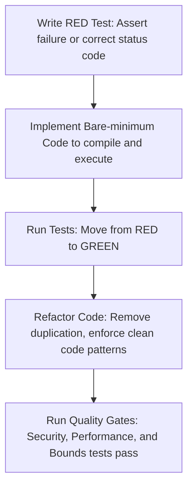

# Technical Specification & Mini-PRD: v0.2 Core User Authentication & Workspace Isolation

**Status**: Approved | **Version**: 0.2 | **Owner**: @architect | **Date**: 2026-05-29
**Strategic Alignment**: Predictability, Strict Tenant Isolation, and Zero-Friction Developer Onboarding.

---

> [!IMPORTANT]
> This technical specification builds directly upon the product discovery conducted in [v0.2 Core User Authentication Discovery](v0.2_auth_discovery.md) and details the implementation blueprint for introducing secure GitHub/Google OAuth, password-based fallback authentication, and strict multi-tenant workspace isolation in Kanbrio. It provides an actionable guide for developers adopting Test-Driven Development (TDD).

---

## 💾 1. Database Schema & SQL DDL Migration

To support user identity, secure sessions, password credentials, and workspace memberships, the following PostgreSQL DDL schema must be implemented in a new migration file: `apps/api/migrations/20260528000000_authentication_and_workspaces.sql`.

```sql
-- Migration: apps/api/migrations/20260528000000_authentication_and_workspaces.sql
-- Description: Core schema for users, credentials, stateful sessions, and workspace isolation boundaries.

-- 1. Core Users Table
CREATE TABLE IF NOT EXISTS users (
    id UUID PRIMARY KEY DEFAULT gen_random_uuid(),
    email VARCHAR(255) UNIQUE NOT NULL,
    name VARCHAR(255) NOT NULL,
    avatar_url TEXT,
    created_at TIMESTAMPTZ NOT NULL DEFAULT NOW(),
    updated_at TIMESTAMPTZ NOT NULL DEFAULT NOW()
);

-- Index for searching users by email quickly during authentication checks
CREATE INDEX IF NOT EXISTS idx_users_email ON users(email);

-- 2. Local Credentials Table (Argon2id password hashes)
CREATE TABLE IF NOT EXISTS user_credentials (
    id UUID PRIMARY KEY DEFAULT gen_random_uuid(),
    user_id UUID UNIQUE NOT NULL REFERENCES users(id) ON DELETE CASCADE,
    password_hash VARCHAR(255) NOT NULL,
    created_at TIMESTAMPTZ NOT NULL DEFAULT NOW(),
    updated_at TIMESTAMPTZ NOT NULL DEFAULT NOW()
);

-- Index on user_id foreign key for credentials lookup
CREATE INDEX IF NOT EXISTS idx_user_credentials_user_id ON user_credentials(user_id);

-- 3. Stateful User Sessions Table
CREATE TABLE IF NOT EXISTS user_sessions (
    id UUID PRIMARY KEY DEFAULT gen_random_uuid(),
    user_id UUID NOT NULL REFERENCES users(id) ON DELETE CASCADE,
    session_token VARCHAR(255) UNIQUE NOT NULL, -- Cryptographically secure high-entropy string
    expires_at TIMESTAMPTZ NOT NULL,
    created_at TIMESTAMPTZ NOT NULL DEFAULT NOW(),
    last_active_at TIMESTAMPTZ NOT NULL DEFAULT NOW()
);

-- Indexes to optimize session validation and cleanup
CREATE INDEX IF NOT EXISTS idx_user_sessions_token ON user_sessions(session_token);
CREATE INDEX IF NOT EXISTS idx_user_sessions_user_id ON user_sessions(user_id);
CREATE INDEX IF NOT EXISTS idx_user_sessions_expires_at ON user_sessions(expires_at);

-- 4. Workspace Members Joint Table (Multi-tenancy membership mapping)
CREATE TABLE IF NOT EXISTS workspace_members (
    workspace_id UUID NOT NULL REFERENCES workspaces(id) ON DELETE CASCADE,
    user_id UUID NOT NULL REFERENCES users(id) ON DELETE CASCADE,
    role VARCHAR(50) NOT NULL CHECK (role IN ('admin', 'member', 'viewer')),
    joined_at TIMESTAMPTZ NOT NULL DEFAULT NOW(),
    created_at TIMESTAMPTZ NOT NULL DEFAULT NOW(),
    updated_at TIMESTAMPTZ NOT NULL DEFAULT NOW(),
    PRIMARY KEY (workspace_id, user_id)
);

-- Indexes on workspace memberships for fast authorization checks
CREATE INDEX IF NOT EXISTS idx_workspace_members_user_id ON workspace_members(user_id);
CREATE INDEX IF NOT EXISTS idx_workspace_members_workspace_id ON workspace_members(workspace_id);

-- 5. Workspace Invitations Table
CREATE TABLE IF NOT EXISTS workspace_invitations (
    id UUID PRIMARY KEY DEFAULT gen_random_uuid(),
    workspace_id UUID NOT NULL REFERENCES workspaces(id) ON DELETE CASCADE,
    inviter_id UUID NOT NULL REFERENCES users(id) ON DELETE CASCADE,
    token VARCHAR(255) UNIQUE NOT NULL, -- Cryptographically secure signed token or high-entropy UUID-hash
    email VARCHAR(255), -- Optional constraint to restrict to a specific invitee email
    role VARCHAR(50) NOT NULL DEFAULT 'member' CHECK (role IN ('admin', 'member', 'viewer')),
    max_uses INT NOT NULL DEFAULT 1,
    uses_count INT NOT NULL DEFAULT 0,
    expires_at TIMESTAMPTZ NOT NULL,
    used_at TIMESTAMPTZ,
    created_at TIMESTAMPTZ NOT NULL DEFAULT NOW()
);

-- Indexes to optimize invite lookup
CREATE INDEX IF NOT EXISTS idx_workspace_invitations_token ON workspace_invitations(token);
CREATE INDEX IF NOT EXISTS idx_workspace_invitations_workspace_id ON workspace_invitations(workspace_id);

-- 6. Integrate existing audit table (card_transitions) with Users
ALTER TABLE card_transitions
ADD CONSTRAINT fk_card_transitions_user FOREIGN KEY (user_id) REFERENCES users(id) ON DELETE SET NULL;

CREATE INDEX IF NOT EXISTS idx_card_transitions_user_id ON card_transitions(user_id);
```

---

## 🚦 2. Numbered Functional Requirements (FR) & Route Mapping

Below is a precise, end-to-end map of requirements (continuing the skeleton sequence from FR9 to FR24) connecting frontend routing, user interaction state, backend API endpoints, and data models.

| Requirement ID | Domain | Feature Description | Backend API Endpoint & Action | Request / Response Contract | Frontend Path & Component |
| :--- | :--- | :--- | :--- | :--- | :--- |
| **FR9** | Auth (OAuth) | **OAuth Provider Redirect Trigger** | `GET /api/auth/login/:provider`<br>Starts handshake, generates `state` & `code_verifier`. | **Query Parameters**: None<br>**Response**: `302 Found` (redirects to GitHub/Google login pages). Stores cryptographically secure `oauth_state` in temporary `HttpOnly` cookie. | `/login`<br>Clicking custom OAuth buttons redirects client to provider URL. |
| **FR10** | Auth (OAuth) | **OAuth Handshake Callback & Account Provisioning** | `GET /api/auth/callback/:provider`<br>Receives code/state, exchanges it for access token, fetches profile, and upserts user. | **Query Parameters**: `code`, `state`<br>**Response**: `200 OK` (sets secure session cookie) + profile data.<br>**Error**: `400 Bad Request` if state/PKCE verification fails. | `/login`<br>Receives parameters, routes to callback component, triggers API verification, forwards to home. |
| **FR11** | Auth (Session) | **Stateful Cookie Issuance & Hardening** | Set by all successful auth handlers. | Sets Cookie Header:<br>`__Host-sid=<session_token>; SameSite=Lax; Secure; HttpOnly; Path=/` | Browser standard handling. The client JavaScript is completely blind to this session cookie. |
| **FR12** | Auth (User) | **Fetch Authenticated User Context** | `GET /api/auth/me`<br>Resolves cookie, checks session table, returns active user details. | **Headers**: `Cookie: __Host-sid=<token>`<br>**Response**: `200 OK` JSON containing `{ id, email, name, avatar_url, workspaces: [...] }`<br>**Error**: `401 Unauthorized` on session expiration/absence. | Bootstrap loading. Triggers `currentUser` signal updates globally inside `AuthProvider`. |
| **FR13** | Multi-Tenancy | **Fetch User Workspace Memberships** | `GET /api/workspaces`<br>Lists all workspaces where the current user has a valid role. | **Response**: `200 OK` JSON array of `<Workspace>` items containing `{ id, name, role, joined_at }`. | Sidebar Navigation Component. Displays list and populates dropdown options. |
| **FR14** | Isolation | **Path-Based TenantGuard Middleware** | Axum Request Layer Extractor (`WorkspaceContext`). Intercepts route parameters. | Extracted from: `/api/workspaces/:workspace_id/*`<br>**Action**: Validates active session and workspace membership. Aborts early if denied. | Client-side routing. Intercepts `/w/:workspace_id` parameters and checks permissions. |
| **FR15** | Isolation | **SQL Query Workspace Scoping** | Repository SQL level (e.g. `CardRepository::get_by_id`). | `SELECT ... WHERE id = $1 AND workspace_id = $2;` binds exact active tenant context. | Bound automatically. Client payload only fetches context matching Route boundaries. |
| **FR16** | Security | **Resource Enumeration Denial (BOLA/IDOR)** | Any card or board request violating tenant boundaries. | **Response**: `404 Not Found` (rather than `403 Forbidden`) if resource belongs to another tenant. | Renders Standard Error boundaries, preserving user path while signaling resource absence. |
| **FR17** | Invitation | **Workspace Invitation Creation** | `POST /api/workspaces/:workspace_id/invitations`<br>Generates secure signed URL for workspace access. | **Body**: `{ email: Option<String>, role: String, expires_in_days: Option<i32> }`<br>**Response**: `201 Created` JSON `{ token, invite_url, expires_at }`. | `/w/:workspace_id/settings`<br>Invite generator panel. Copies generated URLs to clipboard. |
| **FR18** | Invitation | **Invitation Verification Boundary** | `GET /api/invitations/validate`<br>Checks if invitation exists, isn't expired, and has usage remaining. | **Query Parameters**: `token`<br>**Response**: `200 OK` JSON `{ workspace_name, inviter_name, role }`<br>**Error**: `400 Bad Request` if invalid or expired. | `/invite/:token`<br>Calls validate. Shows "Accept invitation to join Organization X". |
| **FR19** | Invitation | **Accept Invitation & Join Workspace** | `POST /api/invitations/join`<br>Consumes token and adds membership row. | **Body**: `{ token }`<br>**Response**: `200 OK` JSON `{ workspace_id, role }` | `/invite/:token`<br>Accept Button triggers POST. Redirects to `/w/:workspace_id` dashboard on success. |
| **FR20** | Invitation | **Single-use & Multi-use Enforcement** | Handled atomically during `POST /api/invitations/join` db transaction. | Transaction checks token expiration, increments `uses_count`, updates `used_at`, locks rows. | Renders clear "Invitation Expired or Already Used" UI error cards on failure. |
| **FR21** | Auth (Local) | **Fallback Email/Password Authentication** | `POST /api/auth/login`<br>Verifies password hash via Argon2id (blocking thread). | **Body**: `{ email, password }`<br>**Response**: `200 OK` (Sets secure session cookie) + user metadata. | `/login`<br>Traditional sign-in form. Updates global Auth context. |
| **FR22** | Auth (Local) | **Fallback User Email Sign-up** | `POST /api/auth/register`<br>Creates user and credentials inside a database transaction. | **Body**: `{ name, email, password }`<br>**Response**: `201 Created` (Sets session cookie) + user metadata. | `/register`<br>User account registration form. |
| **FR23** | Auth (Session) | **Session Invalidation (Logout)** | `POST /api/auth/logout`<br>Deletes session token from DB and commands cookie deletion. | **Response**: `200 OK` + header sets cookie expiration to the past. | Nav Bar Header. "Logout" button invokes endpoint and resets SolidJS Signals to null. |
| **FR24** | Multi-Tenancy | **Active Workspace Selector Switch** | Frontend routing and state provider signals. | Auto-scaped routing context. Sets reactive state. | Sidebar Dropdown. Interacting updates `/w/:workspace_id` path and updates signals. |

---

## 🧪 3. Step-by-Step Test-Driven Development (TDD) Blueprint

Developers must implement features by strictly executing the Red-Green-Refactor testing lifecycle. Code should only be written once tests asserting the expected failure criteria are placed first.



### 3.1 Part 1: Local Hashing, Session Store & Mocked OAuth Endpoint Tests

#### TDD Step-by-Step Cycle (Part 1)
1. **Red**: Write a test asserting that attempting to login via `POST /api/auth/login` fails when credentials are not in the DB, returning `401 Unauthorized`.
2. **Red**: Write an integration test that performs a mocked OAuth handshake redirect callback and verifies it creates the user record if not present, returning a valid cookie.
3. **Green**: Implement the Argon2id hashing wrapper inside `tokio::task::spawn_blocking`, create database transactions, and register the Axum login/callback handlers. Run tests until they pass.
4. **Refactor**: Abstract user creation and session creation into specialized domain services (`UserService` and `SessionService`).

#### Rust Backend Test Blueprint (`apps/api/tests/auth_tests.rs`)

```rust
// File: apps/api/tests/auth_tests.rs
use axum::{
    body::Body,
    http::{self, Request, StatusCode},
};
use kanbrio_api::{create_app, models::user::User};
use serde_json::json;
use tower::ServiceExt;
use uuid::Uuid;
use wiremock::{Mock, MockServer, ResponseTemplate};
use wiremock::matchers::{method, path};

#[sqlx::test]
async fn test_local_registration_and_login_flow(pool: sqlx::PgPool) -> anyhow::Result<()> {
    sqlx::migrate!("./migrations").run(&pool).await?;
    let app = create_app(pool.clone());

    // 1. Register a new user
    let register_response = app.clone()
        .oneshot(
            Request::builder()
                .method(http::Method::POST)
                .uri("/api/auth/register")
                .header(http::header::CONTENT_TYPE, "application/json")
                .body(Body::from(
                    json!({
                        "name": "Jane Doe",
                        "email": "jane@example.com",
                        "password": "securepassword123" // pragma: allowlist secret
                    })
                    .to_string(),
                ))?,
        )
        .await?;

    assert_eq!(register_response.status(), StatusCode::CREATED);

    // Extract session cookie from header
    let cookie_header = register_response.headers()
        .get(http::header::SET_COOKIE)
        .expect("Should set session cookie");
    assert!(cookie_header.to_str()?.contains("__Host-sid"));

    // 2. Perform Login with registered credentials
    let login_response = app
        .oneshot(
            Request::builder()
                .method(http::Method::POST)
                .uri("/api/auth/login")
                .header(http::header::CONTENT_TYPE, "application/json")
                .body(Body::from(
                    json!({
                        "email": "jane@example.com",
                        "password": "securepassword123" // pragma: allowlist secret
                    })
                    .to_string(),
                ))?,
        )
        .await?;

    assert_eq!(login_response.status(), StatusCode::OK);
    Ok(())
}

#[sqlx::test]
async fn test_oauth_callback_provisions_user_with_mock_provider(pool: sqlx::PgPool) -> anyhow::Result<()> {
    sqlx::migrate!("./migrations").run(&pool).await?;

    // Start wiremock to simulate Google/GitHub identity APIs
    let mock_provider = MockServer::start().await;

    // Mock user profile API response
    let profile_payload = json!({
        "id": "12345678",
        "email": "oauth_user@example.com",
        "name": "OAuth User",
        "avatar_url": "https://avatars.com/u/1234"
    });

    Mock::given(method("GET"))
        .and(path("/user"))
        .respond_with(ResponseTemplate::new(200).set_body_json(profile_payload))
        .mount(&mock_provider)
        .await;

    // Inside the application configuration, mock providers point to `mock_provider.uri()`
    // We invoke the callback directly simulating OAuth callback redirection
    let app = create_app(pool.clone());

    let callback_response = app
        .oneshot(
            Request::builder()
                .method(http::Method::GET)
                .uri("/api/auth/callback/github?code=mock_code&state=mock_state")
                .header(
                    http::header::COOKIE,
                    "oauth_state=mock_state; Path=/; HttpOnly; Secure"
                )
                .body(Body::empty())?,
        )
        .await?;

    // Asserts successful login session creation
    assert_eq!(callback_response.status(), StatusCode::OK);

    // Assert user row exists in database
    let user_exists = sqlx::query_scalar::<_, bool>(
        "SELECT EXISTS(SELECT 1 FROM users WHERE email = 'oauth_user@example.com')"
    )
    .bind("oauth_user@example.com")
    .fetch_one(&pool)
    .await?;

    assert!(user_exists);
    Ok(())
}
```

---

### 3.2 Part 2: TenantGuard Middleware & Workspace Isolation Scoping Tests

The `TenantGuard` middleware asserts that requests bound to path variables such as `/api/workspaces/:workspace_id/*` or carrying headers check the `workspace_members` join table using the user id extracted from the session cookie.

#### TDD Step-by-Step Cycle (Part 2)
1. **Red**: Write a test where User A (holding a valid session for Workspace A) makes an API call targeting `/api/workspaces/<workspace_b_uuid>/board`. Assert it fails with a `404 Not Found` (non-enumeration rule) rather than `200 OK` or `403 Forbidden`.
2. **Red**: Write a database isolation test asserting that direct repository queries for columns or swimlanes fail to retrieve data if the parsed workspace identifier does not belong to the calling resource's boundaries.
3. **Green**: Build the Axum custom extractor `WorkspaceContext` implementing the `FromRequestParts` trait. Make it perform the SQL query asserting the user's active membership in the workspace. Inject this extractor into handlers. Run tests until they pass.
4. **Refactor**: Optimize the query inside the custom extractor. Since a membership lookup executes on every request, refine the index layout or introduce structured error types mapping from `AppError` to Axum responses.

#### Rust Backend Test Blueprint (`apps/api/tests/tenant_guard_tests.rs`)

```rust
// File: apps/api/tests/tenant_guard_tests.rs
use axum::{
    body::Body,
    http::{self, Request, StatusCode},
};
use kanbrio_api::create_app;
use serde_json::json;
use tower::ServiceExt;
use uuid::Uuid;

#[sqlx::test]
async fn test_tenant_isolation_boundary_enforcement(pool: sqlx::PgPool) -> anyhow::Result<()> {
    sqlx::migrate!("./migrations").run(&pool).await?;

    let workspace_a = Uuid::new_v4();
    let workspace_b = Uuid::new_v4();
    let user_a = Uuid::new_v4();

    // 1. Database Seed
    // Insert workspaces
    sqlx::query("INSERT INTO workspaces (id, name) VALUES ($1, 'Workspace A'), ($2, 'Workspace B')")
        .bind(workspace_a).bind(workspace_b).execute(&pool).await?;

    // Insert User A
    sqlx::query("INSERT INTO users (id, email, name) VALUES ($1, 'user_a@example.com', 'User A')")
        .bind(user_a).execute(&pool).await?;

    // Map User A to Workspace A only
    sqlx::query("INSERT INTO workspace_members (workspace_id, user_id, role) VALUES ($1, $2, 'member')")
        .bind(workspace_a).bind(user_a).execute(&pool).await?;

    // Create an active session token for User A
    let session_token = "secure_user_a_session_string";
    sqlx::query(
        "INSERT INTO user_sessions (user_id, session_token, expires_at) VALUES ($1, $2, NOW() + INTERVAL '1 day')"
    )
    .bind(user_a).bind(session_token).execute(&pool).await?;

    let app = create_app(pool);

    // 2. Action A: Attempt access to Workspace A (Authorized)
    let request_a = Request::builder()
        .method(http::Method::GET)
        .uri(format!("/api/workspaces/{}/board", workspace_a))
        .header(http::header::COOKIE, format!("__Host-sid={}", session_token))
        .body(Body::empty())?;

    let response_a = app.clone().oneshot(request_a).await?;
    assert_eq!(response_a.status(), StatusCode::OK);

    // 3. Action B: Attempt access to Workspace B (Unauthorized - NOT_FOUND to prevent enumeration)
    let request_b = Request::builder()
        .method(http::Method::GET)
        .uri(format!("/api/workspaces/{}/board", workspace_b))
        .header(http::header::COOKIE, format!("__Host-sid={}", session_token))
        .body(Body::empty())?;

    let response_b = app.oneshot(request_b).await?;

    // CRITICAL SECURITY ASSERTION: MUST return 404 (Not Found) rather than 403 (Forbidden)
    // to shield the existence of Workspace B from User A.
    assert_eq!(response_b.status(), StatusCode::NOT_FOUND);

    Ok(())
}
```

---

### 3.3 Part 3: SolidJS AuthProvider Context & Routing Guards Tests

The frontend uses standard signals inside an `AuthProvider` state hook. Router navigation checks user status using reactive guards.

#### TDD Step-by-Step Cycle (Part 3)
1. **Red**: Write a test asserting that if `currentUser` is `null` (not logged in), navigating to `/w/some-workspace-id` automatically forces a redirection to `/login`.
2. **Red**: Write a test confirming that if a user switches workspaces using `switchWorkspace("workspace_b")`, the `activeWorkspace` signal is updated, and the browser URL correctly transitions.
3. **Green**: Build the `<AuthProvider>` component, implementing signals for `currentUser` and `activeWorkspace`. Implement the routing hook that checks auth state during route transition. Run tests until they pass.
4. **Refactor**: Clean up the API fetching structures in `/src/api/auth.ts`. Implement interceptors that handle `401 Unauthorized` API responses by automatically clearing signals and kicking the user back to the login route.

#### SolidJS Client Test Blueprint (`apps/web/src/components/AuthProvider.test.tsx`)

```tsx
// File: apps/web/src/components/AuthProvider.test.tsx
import { render, screen, fireEvent, waitFor } from '@solidjs/testing-library';
import { Router, Route, Routes, useLocation } from '@solidjs/router';
import { AuthProvider, useAuth } from './AuthProvider';
import ProtectedRoute from './ProtectedRoute';

// 1. Mock Global fetch API to simulate Backend endpoints
const mockFetch = vi.fn();
global.fetch = mockFetch;

describe('AuthProvider & Client Route Security Guards', () => {
  beforeEach(() => {
    mockFetch.mockClear();
  });

  it('redirects unauthenticated users to the /login path', async () => {
    // Mock /api/auth/me returning 401 Unauthorized
    mockFetch.mockResolvedValueOnce({
      status: 401,
      ok: false,
      json: async () => ({ error: "Unauthorized" }),
    });

    const TestComponent = () => (
      <Router>
        <AuthProvider>
          <Routes>
            <Route path="/login" component={() => <div>Login Screen</div>} />
            <Route path="/w/:workspace_id" component={() => (
              <ProtectedRoute>
                <div>Private Dashboard</div>
              </ProtectedRoute>
            )} />
          </Routes>
        </AuthProvider>
      </Router>
    );

    render(() => <TestComponent />);

    // Force navigate to a secure dashboard path
    window.location.hash = '/w/550e8400-e29b-41d4-a716-446655440000';

    // Assert that the Route Guard automatically pushed the user to /login
    await waitFor(() => {
      expect(screen.getByText('Login Screen')).toBeInTheDocument();
    });
  });

  it('allows authenticated users to access secure workspace path', async () => {
    // Mock /api/auth/me returning valid user profile details
    mockFetch.mockResolvedValueOnce({
      status: 200,
      ok: true,
      json: async () => ({
        id: "usr_1",
        email: "authenticated@example.com",
        name: "Arthur Dent",
        workspaces: [{ id: "w_1", name: "Heart of Gold", role: "member" }]
      }),
    });

    const TestComponent = () => (
      <Router>
        <AuthProvider>
          <Routes>
            <Route path="/login" component={() => <div>Login Screen</div>} />
            <Route path="/w/:workspace_id" component={() => (
              <ProtectedRoute>
                <div>Private Dashboard</div>
              </ProtectedRoute>
            )} />
          </Routes>
        </AuthProvider>
      </Router>
    );

    render(() => <TestComponent />);

    window.location.hash = '/w/w_1';

    await waitFor(() => {
      expect(screen.getByText('Private Dashboard')).toBeInTheDocument();
    });
  });
});
```

---

## 🔒 4. Technical Constraints, Audits & Security Controls

### 4.1 Argon2id Computational Hash Profile
To resist GPU/ASIC brute-force dictionary attacks, the backend password verification engine must configure Argon2id with these exact settings (conforming to OWASP guidelines):
- **Memory Cost (m)**: `15,360 KiB` (15 MB).
- **Time Cost (t)**: `2 iterations`.
- **Parallelism (p)**: `1 lane` (optimized for single-core execution inside Axum's thread pool).
- **Salt Length**: `16 bytes` generated via cryptographically secure random number generator (`rand::rngs::OsRng`).
- **Key Length**: `32 bytes`.

### 4.2 Hardened Cookie Security Attributes
Cookies containing user session keys must strictly adhere to standard production guidelines:
- **`HttpOnly`**: Set `true`. Prevents client-side scripts from reading the cookie value (blocking XSS exfiltration).
- **`Secure`**: Set `true`. Instructs browsers to transmit cookies *only* over encrypted TLS (HTTPS) channels.
- **`SameSite=Lax`**: Neutralizes standard cross-site request forgery attacks while allowing user transitions from external invitations.
- **`__Host-` Prefix**: Forces the cookie to be bound exclusively to the domain name of the serving host, preventing subdomain cookie hijacking.
- **`Path=/`**: Restricts the cookie boundary scope to the entire site routing pool.

### 4.3 Mitigation of Horizontal Privilege Escalation
To protect tenant boundaries from broken object-level authorization (BOLA) and ID enumeration, the following controls are mandatory:
- **Workspace Bounds Isolation checks**: The SQL execution must explicitly join `workspace_members` on the calling session ID for every entity modification.
- **Non-enumeration of resource existence**: Attempts to query cards, columns, swimlanes, or histories that do not belong to the user's workspace memberships must trigger a `404 Not Found` payload instead of a `403 Forbidden`.
- **Relationship Bounds Enforcement**: Before linking a parent card (hierarchical adjacency list model) to a child, the repository transaction must verify that both parent and child belong to the *same* `workspace_id`. Cross-workspace card parent assignment must be blocked and return `StatusCode::BAD_REQUEST`.

---

## 📈 5. Success Metrics & Performance Targets

1. **Isolation Integrity**: Zero multi-tenancy tests fail. Data from Workspace A must never bleed into Workspace B.
2. **Access Latency**: Membership resolution inside the custom `WorkspaceContext` Axum extractor must run in `< 10ms` for 99% of requests. This is achieved by placing a compound primary key index on `workspace_members(workspace_id, user_id)`.
3. **Session Invalidations**: Clicking Logout must invalidate and delete the token from the database and remove the cookie in `< 50ms`.
