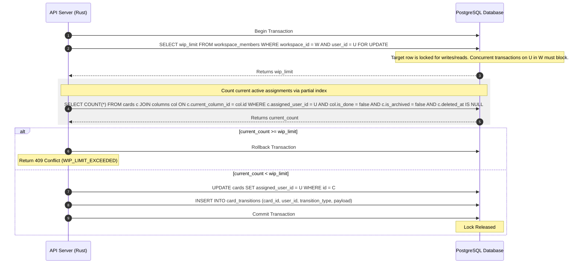

# Product Discovery & Technical Architecture: User WIP Limits (GitHub #37)

**Status**: Proposal | **Version**: 0.3 | **Date**: 2026-05-29
**Authors**: @product-manager, @architect, @ux-designer, @security
**Strategic Alignment**: Flow Efficiency, Anti-Burnout, Multi-Tenant Boundary Integrity, and Concurrency Safety.

---

> [!NOTE]
> This document details the product requirements, technical architecture, interaction specifications, and threat model for implementing **User-Level Work-in-Progress (WIP) Limits** in Kanbrio. This builds directly upon the foundations established in [v0.1 User Stories](v0.1_user_stories.md), [v0.1 Mini-PRD](v0.1_mini_prd.md), and [v0.2 Core User Authentication](v0.2_auth_discovery.md).

---

## 👥 Part 1: Product Discovery & Requirements

### 1.1 Primary Personas

We target three core personas whose security, flow, and delivery metrics define our User WIP Limits strategy:

#### 1.1.1 The Collaborator (The "Focused Builder")
*   **Core Need**: Frictionless flow, high concentration on active tasks, and absolute protection from cognitive over-allocation or burnout.
*   **Pain Point**: Being assigned multiple tickets simultaneously ("multitasking"), causing context-switching waste, delays, and poor quality.
*   **Desired Outcome**: Clear visibility into their own capacity limits and automated blocks preventing others from dumping work on them.

#### 1.1.2 The Agile Coach (The "Flow Optimizer")
*   **Core Need**: Systematic and predictable Kaizen. Surfacing team bottlenecks cleanly in real-time.
*   **Pain Point**: Standard column WIP limits hiding individual over-burdening (e.g., one person holding 5 active cards in an active column while the column limit is 10).
*   **Desired Outcome**: Standardized individual WIP limits scoping active work so bottlenecks are quickly surfaced as "blocked" states rather than hidden queues.

#### 1.1.3 The Workspace Admin (The "Capacity Coordinator")
*   **Core Need**: Total administrative control over operational constraints with the flexibility to handle urgent production incidents.
*   **Pain Point**: Rigid systems that block critical emergency bug assignments during high-pressure deadlocks, forcing teams to bypass the tool entirely.
*   **Desired Outcome**: Strict default limits with an explicit, fully-audited administrative override procedure for production-critical situations.

---

### 1.2 Jobs-to-be-Done (JTBD) User Stories

#### US1: Setting Workspace-Specific User WIP Limits
*   **JTBD**: When I am managing a collaborative workspace, I want to set individual, workspace-specific active task limits for team members, so I can restrict the number of concurrently assigned in-progress work items according to their operational roles.
*   **Acceptance Criteria**:
    *   **AC1.1**: Only Workspace Admins can edit or clear a user's WIP limit. Non-admins receive an HTTP `403 Forbidden` response.
    *   **AC1.2**: WIP limits must be workspace-specific, stored inside the `workspace_members` table. A user's capacity in Workspace A does not impact their capacity in Workspace B.
    *   **AC1.3**: The value must be a positive integer greater than zero (`> 0`). Null or clearing represents "unlimited" capacity.

#### US2: Active Task WIP Counting & State Exceedance
*   **JTBD**: When I pull a card into an active workflow stage or assign a card, I want the system to calculate the assignee's current active card count against their limit, so we can ensure the operational capacity boundaries are respected.
*   **Acceptance Criteria**:
    *   **AC2.1**: A card only counts toward active WIP if it is: (1) assigned, (2) not archived, (3) not soft-deleted, and (4) in a column where `is_done = false`.
    *   **AC2.2**: WIP checks must be triggered by: direct assignment, assignee modification, moving an assigned card from a "Done" column to an active column, card creation with a starting assignee, or unarchiving a card.
    *   **AC2.3**: Exceeding the limit must reject the operation, roll back database updates, and return HTTP `409 Conflict` with error code `WIP_LIMIT_EXCEEDED`.

#### US3: Admin Emergency Overrides
*   **JTBD**: When a critical production blocker occurs, I want to assign an active ticket to a specialist who is already at their WIP limit, so we can resolve emergencies immediately while maintaining a transparent log of exceptions.
*   **Acceptance Criteria**:
    *   **AC3.1**: Workspace Admins can pass an `override: true` and `override_reason: String` payload in assignments to bypass the limit check.
    *   **AC3.2**: Non-admins attempting to override receive a `403 Forbidden` rejection.
    *   **AC3.3**: Overrides must write an audited transition log in `card_transitions` with the type `'assign_override'` or `'move_override'`.

---

### 1.3 Numbered Functional Requirements (FR)

*   **FR21**: The system must store `is_done` on `columns` to differentiate active stages from completed stages.
*   **FR22**: The system must enforce a workspace-specific `wip_limit INT` inside the `workspace_members` relation, constrained to `wip_limit > 0`.
*   **FR23**: Cards must support an optional `assigned_user_id UUID` referencing `users(id)`.
*   **FR24**: The backend must execute validation hooks within database transactions using pessimistic row locking to prevent multi-transaction race conditions.
*   **FR25**: Direct API manipulations targeting card properties (general PUT/PATCH endpoints) must invoke the same transactional assignee WIP validator as the specialized `/assign` endpoint.
*   **FR26**: All assignee transitions, including unassignment and administrative overrides, must write immutable event payloads to the `card_transitions` table.

---

## 🛠️ Part 2: Technical Design & Architecture

### 2.1 Storage Location Trade-offs Evaluation

We evaluated whether to store user WIP limits globally in the `users` table or locally in the `workspace_members` table:

| Dimension | Option A: `users` Table (Global) | Option B: `workspace_members` Table (Workspace-Scoped) |
| :--- | :--- | :--- |
| **Multi-Tenant Boundary** | **Weak**. Violates B2B isolation. Admins in Tenant A could alter a config that limits a user in Tenant B. | **Strong**. Complete isolation. Workspace Admins have isolated control over their members' capacities. |
| **Operational Flexibility** | **Rigid**. A developer cannot have different capacities when acting in different roles across workspaces. | **Flexible**. Allows distinct capacity bounds tailored to the member's specific workflow in each workspace. |
| **Lock Contention** | High contention on the global user index across completely unrelated workspaces. | Lock is isolated to a single row `(workspace_id, user_id)` in the membership table. |
| **Decision** | **DISCARDED** | **APPROVED** |

---

### 2.2 Concurrency & Concurrency Safe Locking Strategy

To eliminate assignment race conditions (where two simultaneous requests assign different cards to User X, both reading `current_count < limit` and both committing, breaching the limit), we enforce a **Pessimistic Configuration-Lock Pattern**:



To optimize the count query, we implement a **Partial SQL Index**:
```sql
CREATE INDEX IF NOT EXISTS idx_cards_assigned_active
ON cards(assigned_user_id, workspace_id)
WHERE is_archived = false AND deleted_at IS NULL AND assigned_user_id IS NOT NULL;
```
This guarantees an extremely fast index-only scan, executing in logarithmic $O(\log N)$ time, avoiding full table scans.

---

## 🔒 Part 3: Preliminary Threat Model

We conducted a threat model targeting security boundaries and logic bypasses.

### 3.1 Security Findings & Mitigations

*   **[CRITICAL] IDOR Limit Modification**: An attacker in Workspace A modifies the WIP limit of a user in Workspace B by tampering with the URL.
    *   *Mitigation*: Implement strict role checks using `TenantGuard` to assert the actor is an `admin` inside `workspace_members` for the target `workspace_id`.
*   **[HIGH] Concurrency Race Condition Bypass**: Concurrent assignment operations allow exceeding active limits.
    *   *Mitigation*: Mandatory `SELECT ... FOR UPDATE` row locking on `workspace_members` prior to counting active tasks.
*   **[HIGH] General Route Property Bypass**: Users updating cards via `/api/cards/:id` bypass the assignee limits validation.
    *   *Mitigation*: Centralize validation checks in the database model tier (`Card` service update methods) rather than handler controllers.
*   **[MEDIUM] Soft-Delete/Archive Restores Bypass**: Unarchiving a card pushes an assignee over their limit.
    *   *Mitigation*: Assert the user WIP limit inside the `Card::unarchive` database transaction.

### 3.2 Preliminary Audit Verdict
🏆 **`PASS WITH NOTES`**
The feature design is highly secure and robust, provided that core model transitions use centralized transaction controls, pessimistic row locking on the configuration, and role guards on settings.

---

## 🎨 Part 4: UX & Interaction Specifications

### 4.1 Visual Tokens & Color Mapping (Section 2, `DESIGN.md`)
*   **Normal Capacity (< Limit)**: Sober `text-secondary` (#4B5563 / Dark: #94A3B8). Progress bar: `bg-accent-primary` (#2563EB).
*   **At Capacity (= Limit)**: Warning `text-orange-500 bg-orange-50` (Dark: `text-orange-400 bg-orange-900/20`). Progress bar: `bg-orange-500`.
*   **Capacity Exceeded (> Limit)**: Danger `text-red-500 bg-red-50` (Dark: `text-red-400 bg-red-900/20`). Progress bar: `bg-red-500`.

### 4.2 Layout & Component Specifications
1.  **Sidebar Team Capacity Widget**:
    *   Row-based vertical lists (`p-2 gap-1 rounded-md hover:bg-elevated transition-all`).
    *   Displays name, circular avatar (`rounded-full`), capacity fractions `[Active / Limit]`, and inline settings toggles.
    *   Includes a fine-grained capacity progress bar (`h-1 bg-elevated rounded-full`) transitioning its color and width in standard cubic motion (`cubic-bezier(0.2, 0, 0, 1)`, `duration-300`).
2.  **Card Assignee Avatar Rings**:
    *   Cards at capacity display a warning ring: `ring-2 ring-orange-400/80` or `ring-2 ring-red-500 animate-pulse` with matching status dot overlays.

### 4.3 Micro-Animations & Error Feedback
*   **Invalid Drop Shake**: Attempts to drag-and-drop a card onto a user at their WIP limit are optimistically processed, rejected by the server, and rolled back with a 300ms horizontal shake animation (`animate-shake`) on the card and the matching sidebar row.
*   **Persistent Red Toast**: Renders a floating notification box at the bottom right: `"WIP Limit Exceeded: Jane is already at their limit of 3 active tasks."`

### 4.4 Playwright Test Anchors (`data-testid`)
*   Panel: `data-testid="member-wip-panel"`
*   Item Row: `data-testid="member-wip-item-{user_id}"`
*   Limit Input: `data-testid="member-wip-input-{user_id}"`
*   Card Avatar Ring: `data-testid="card-avatar-wip-ring-{user_id}"`
*   Toast Warning: `data-testid="wip-limit-exceeded-toast"`

---

This completes the structured Product Discovery document. The technical blueprint and exact TDD specs are located in the [User WIP Limits Technical Specification & Mini-PRD](v0.3_user_wip_limits_mini_prd.md).
