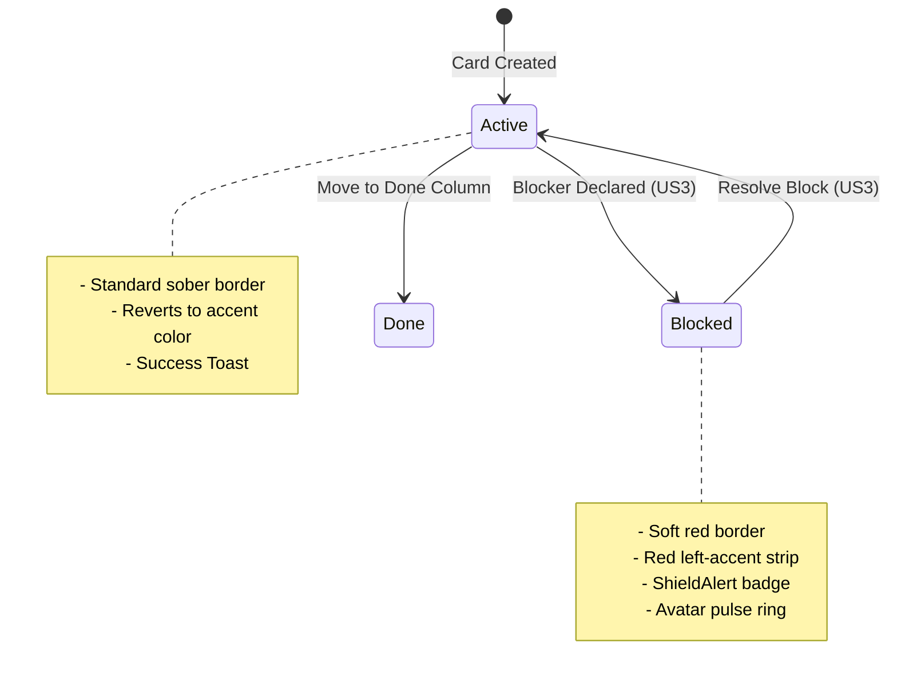

# Product Discovery: Transition & Blocker Visual Language (beads ID: kanbrio-aru)

**Status**: Proposal | **Version**: 0.5 | **Date**: 2026-05-30
**Authors**: @product-manager (OODA PM Discovery), @ux-designer, @architect
**Strategic Alignment**: Flow Efficiency, Visual Kanban Maturity, Bottleneck Resolution, Low-Latency Micro-interactions, and Audit Trail Compliance.

---

> [!NOTE]
> This document details the product strategy, user personas, Jobs-to-be-Done (JTBD), and visual interaction specifications for the **Transition & Blocker Visual Language** in Kanbrio. This builds directly upon the 2D Board grid (v0.1), Workspace Authentication (v0.2), User WIP Limits (v0.3), and Arrival/Departure Rules (v0.4), introducing a highly intuitive visual system for identifying obstructions and conveying fluid board transitions.

---

## 👥 Part 1: Product Strategy & Strategic Value

In high-velocity development environments, visibility of bottlenecks is the single most critical driver of Lead Time reduction. In standard task management systems, "blocked" cards are often hidden under a textual tag or a small static icon, requiring team members to actively search for them. This lack of urgency leads to delayed resolutions and increased Work-in-Progress (WIP) stagnation.

Kanbrio introduces an **Active Bottleneck Visual Strategy** that treats blocked tasks with the highest degree of visual prominence ("Stop the Line" mentality, inspired by Toyota's *Andon Cord*), while maintaining a clean, clutter-free grid.

Concurrently, board transitions are designed to leverage high-performance micro-animations and color gradients to make the web app feel like a native, low-latency client. By coupling optimistic UI movements with physics-based horizontal rollbacks (`animate-shake`) during policy violations, Kanbrio teaches users the boundaries of their flow without frustrating modal intercepts.

---

## 🧑‍🤝‍🧑 Part 2: Primary Personas

We define our strategy around three primary personas whose interactions with blocked states and transitions govern their efficiency and satisfaction:

### 2.1 The Blocked Developer ("The Obstructed Builder")
*   **Core Need**: A friction-free mechanism to flag blockers, document the contextual obstruction, and collaborate directly with teammates on resolution without breaking focus.
*   **Pain Point**: Having to search through separate Slack threads or generic comment logs to explain why a task is stuck, or worse, having their blocked state ignored by the team.
*   **Desired Outcome**: High-context, localized blocking mechanisms that broadcast the obstruction and provide a dedicated space for resolution discussion.

### 2.2 The Flow Guardian Coach ("The Bottleneck Optimizer")
*   **Core Need**: Instant, clear visual feedback showing which cards are obstructed from 10 feet away, how long they have been blocked, and what the root cause is, so they can coordinate immediate assistance.
*   **Pain Point**: Spending time in standup asking "Is this blocked?" because the board view is passive and text-dense.
*   **Desired Outcome**: A highly visual board where blocked cards command attention, with easy access to resolution stats and logs.

### 2.3 The Workspace Coordinator ("The Operations Manager")
*   **Core Need**: Absolute integrity of board rules (WIP limits, arrival/departure checklists) combined with a fluid, zero-friction transition feel that enforces policies automatically.
*   **Pain Point**: Users bypassing rules because the system is clunky or annoying, or developers getting frustrated by abrupt, hard error screens.
*   **Desired Outcome**: Low-latency, physics-based transition states that guide developers gently through valid and invalid moves.

---

## 🎯 Part 3: Jobs-to-be-Done (JTBD) User Stories

### US1: Visualizing Blocked Cards on the 2D Board
*   **JTBD**: When I view the 2D board grid, I want blocked cards to instantly command visual attention through color, borders, and status badges, so that I can immediately identify and address flow bottlenecks.
*   **Acceptance Criteria**:
    *   **AC1.1**: Blocked cards must apply specialized design tokens: a custom red border (`border-status-blocked`), a light red background tint (`bg-status-blocked/5`), and a solid red left-accent border strip (`w-1 h-full bg-status-blocked absolute left-0 top-0 rounded-l-md`).
    *   **AC1.2**: Blocked cards must display a dedicated blocker badge containing the `ShieldAlert` icon and the truncated blocker reason immediately below the card title.
    *   **AC1.3**: The avatar of the assignee on a blocked card must feature an active pulse ring (`ring-2 ring-status-blocked/40 animate-pulse`), signaling that the builder's flow is currently obstructed.

### US2: Contextual Blocker Side-Drawer & Discussion
*   **JTBD**: When I click on a blocked card or its blocker badge, I want to slide out a high-context detail panel, so I can read the full obstruction reason, see who created the block and when, and participate in a dedicated resolution-focused comment thread.
*   **Acceptance Criteria**:
    *   **AC2.1**: Clicking the blocker badge or card triggers a slide-out panel (`Subtree Drawer` style, 400px width) from the right edge with standard animation (`duration-300 ease-standard`).
    *   **AC2.2**: The drawer header must display an urgent status banner (`bg-red-50 text-red-700 dark:bg-red-950/30 dark:text-red-400 p-3 rounded-md flex gap-2 items-center`) showing the blocker title and the elapsed time since the block was created (e.g., `Blocked for 3 days`).
    *   **AC2.3**: The drawer must render a dedicated block comment section, isolating blocker discussion from the card's general comments, enabling targeted alignment.

### US3: Declaring and Resolving Blocks with Audit Logging
*   **JTBD**: When a dependency or bottleneck arises (or is resolved), I want to easily toggle a card's block state, provide a structured reason (or resolution summary), and log this transition, so that the team is informed and the flow history is fully audited.
*   **Acceptance Criteria**:
    *   **AC3.1**: Workspace Members can block a card via the card's actions dropdown, prompting a modal to input a Block Title and Block Description.
    *   **AC3.2**: Resolving a block requires a Workspace Member/Admin to click "Resolve Block" in the drawer, prompting a short "Resolution Summary" input.
    *   **AC3.3**: Toggling block states must write immutable records to the `card_transitions` table with types `'card_blocked'` and `'card_unblocked'`, capturing actor, timestamp, and details.
    *   **AC3.4**: Resolving a block triggers a transient green success toast at the bottom right (`bg-surface border-status-done text-primary shadow-xl`).

### US4: Drag-and-Drop Transition Visual Feedback
*   **JTBD**: When I drag a card across columns or swimlanes, I want the interface to provide active, low-latency visual guidance (valid targets vs. invalid target states), so I can move cards confidently and understand constraints instantly.
*   **Acceptance Criteria**:
    *   **AC4.1**: Active dragging must apply: 105% scaling, a slight rotation (`rotate-2`), high drop-shadow (`shadow-2xl`), and a 300ms transition time (`duration-300 ease-standard`).
    *   **AC4.2**: Columns that are valid targets under active policies must display a subtle background tint and border hover highlight (`bg-accent-primary/[0.02] border border-dashed border-accent-primary/30`).
    *   **AC4.3**: Successful card placement must snap the card with a spring-like ease (`duration-300 ease-standard`) and pulse the column count indicator briefly.

### US5: Optimistic UI Physics Rollbacks on Policy Violations
*   **JTBD**: When I drag a card to a column where a policy check fails (e.g., WIP limit breach, missing assignee arrival rule), I want the card to instantly roll back to its original coordinate with a horizontal shake animation and an explanatory alert, so I receive clear feedback.
*   **Acceptance Criteria**:
    *   **AC5.1**: Operations rejected by the server (`409 Conflict` for WIP or `422 Unprocessable Entity` for rules) must immediately trigger a coordinate rollback in the DOM.
    *   **AC5.2**: Upon rolling back, the card must execute a 300ms horizontal shake animation (`animate-shake`).
    *   **AC5.3**: A red floating Alert Toast must slide up from the bottom-right corner, detailing the specific violation (e.g., `[Arrival Rule Violation]: QA requires an Assignee before entry.`).

---

## 🎨 Part 4: Visual and Transition States

To ensure a seamless, high-fidelity experience, the OODA PM Discovery outlines the following structured visual states to be integrated into `DESIGN.md` in Phase 2:

### 4.1 Card State Progression

### 4.2 Drag-and-Drop Drag & Drop Logic Flows

We differentiate between successful moves and policy-rejected drops with distinct physics-based interaction loops:

#### 4.2.1 Successful Drop Lifecycle (US4)
1. **Drag Start**: User picks up the card. Card applies `scale-105 rotate-2 shadow-2xl opacity-80 transition-transform duration-150`.
2. **Hovering**: As the card passes columns, valid columns highlight with `bg-accent-primary/[0.02] border-accent-primary/20`.
3. **Drop Release**: User drops the card in a valid, unconstrained column.
4. **Optimistic Snap**: The card instantly snaps into the target column coordinate.
5. **Server Commit**: Background database update completes (`200 OK`). The column header WIP counter pulses gently (`animate-pulse`) to show the updated calculation.

#### 4.2.2 Rejected Drop Lifecycle (US5)
1. **Drag Start & Release**: User drags and releases a card on a column that violates a WIP limit or check rule.
2. **Optimistic Move**: Card tentatively lands on the column.
3. **Server Rejection**: Backend API returns `409 Conflict` (WIP limit exceeded) or `422 Unprocessable Entity` (policy breach).
4. **Coordinate Rollback**: The frontend interceptor rolls the card position back to its origin.
5. **Animate Shake**: The card performs a high-performance 300ms horizontal shake (`animate-shake`).
6. **Error Alert Toast**: Renders a floating toast in the bottom-right containing a `ShieldAlert` icon and the specific rejection message.

---

## 📊 Part 5: RICE Prioritization & Operational Scope

To align execution with the product roadmap, we weigh the strategy using the RICE scoring model:

| Issue / Feature Component | Reach (1-10) | Impact (0.5-3) | Confidence (50%-100%) | Effort (Person-Weeks) | RICE Score | MoSCoW |
| :--- | :--- | :--- | :--- | :--- | :--- | :--- |
| **Card Blocker Visual State & Pulse Rings (US1)** | 10 (All users) | 2.0 (High visibility) | 90% (Design validated) | 0.5 | **360** | **Must Have** |
| **Contextual Blocker Detail Side-Drawer (US2)** | 8 (Blocked users) | 2.0 (High collaboration) | 85% (UX spec'd) | 1.0 | **136** | **Must Have** |
| **Block Trigger and Transition Auditing (US3)** | 6 (Active members) | 1.5 (High trust) | 90% (Backend simple) | 0.8 | **101** | **Should Have** |
| **Spring Snapping & Transition Gradients (US4)** | 10 (All users) | 1.5 (Premium feel) | 80% (Pragmatic D&D) | 0.6 | **200** | **Must Have** |
| **Physics-Based Rejection Rollbacks (US5)** | 5 (Edge actions) | 2.5 (High learning) | 85% (Framework native) | 0.5 | **212** | **Should Have** |

### Strategic Verdict:
We prioritize **US1, US4, and US2** as the critical core delivery paths, establishing the absolute visual language. **US3 and US5** are sequenced in immediate fast-follow sprints to guarantee transaction auditing and error-recovery robustness.

---

## 🔒 Part 6: Preliminary Security & SRE Audits

### 6.1 Multi-Tenant Block Isolation (Security Guard)
*   **Risk**: A user in Workspace A could craft a POST request to block/unblock a card in Workspace B.
*   **Mitigation**: Block actions must pass through `WorkspaceTenantGuard`. Assert that the actor holds verified active membership inside the specific workspace mapped to the target card's column.

### 6.2 Concurrent Block Toggles (SRE Blast-Radius)
*   **Risk**: Simultaneous block/unblock requests on the same card could create duplicate `card_transitions` or corrupt the card's `is_blocked` field in database states.
*   **Mitigation**: Use pessimistic write locks (`SELECT ... FOR UPDATE`) on the target `cards` table row before calculating and applying block transitions. This ensures sequential event consistency.

---

## 🚦 Part 7: Playwright Test Anchors (`data-testid`)

The developer MUST include the following DOM anchors to enable rigorous end-to-end testing:

*   Blocked Card Container: `data-testid="card-blocked-container-{card_id}"`
*   Blocker Badge on Card: `data-testid="card-blocker-badge-{card_id}"`
*   Blocker Avatar Ring: `data-testid="card-avatar-blocked-ring-{user_id}"`
*   Slide-Out Blocker Drawer: `data-testid="blocker-detail-drawer"`
*   Blocker Drawer Header Banner: `data-testid="blocker-drawer-banner"`
*   Resolve Block Button: `data-testid="resolve-block-button"`
*   Block Comment Thread Container: `data-testid="block-comments-container"`
*   Rollback Animate Target: `data-testid="card-rollback-shake-{card_id}"`
*   Rejection Error Toast: `data-testid="rejection-alert-toast"`

---

This concludes **Phase 1: PM Strategy Discovery** for the Transition & Blocker Visual Language. The OODA Orchestrator is notified, and we are ready to transition to **Phase 2: Visual & Focus Design** for `@ux-designer` layout specs.
