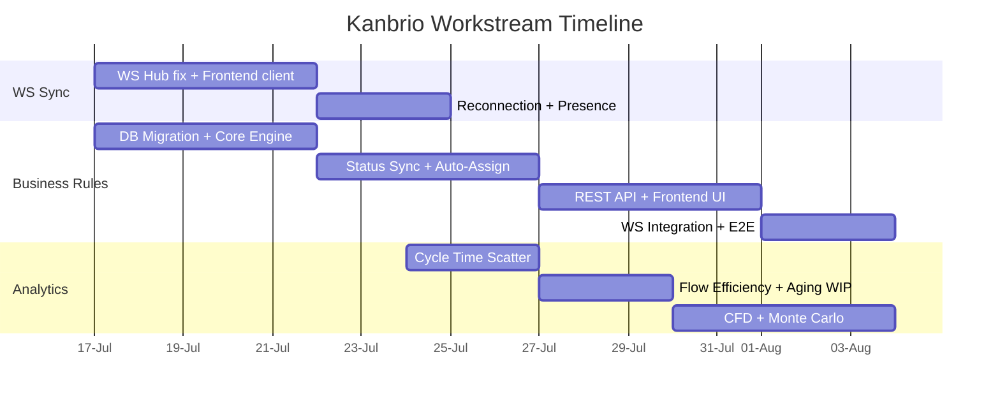

# Workstream Discovery & Execution Plan

**Status**: Discovery Complete | **Date**: 2026-07-16
**Author**: @ooda-orchestrator

---

## Overview

14 open issues clustered into 3 independent workstreams. Each workstream has existing discovery docs (user stories + mini-PRD). This document provides the execution mapping.

---

## Workstream 1: Business Rules Engine (IFTTT)

**Issues**: 8 (1 epic closed, 7 subtasks + kanbrio-kud)
**Priority**: P2
**Docs**: `docs/product/business_rules_user_stories.md`, `docs/product/business_rules_mini_prd.md`
**Dependencies**: WS sync workstream (for AC-7 broadcast)

### Issues & Execution Order

| Order | ID | Description | Type | Effort | AC Ref |
|:---|:---|---:|:---|:---:|:---|
| 1 | `.1` | DB Migration for Business Rules Schema | Task | 0.2wk | AC-1 |
| 2 | `.2` | Rust Backend Core Engine | Feature | 0.6wk | AC-2 |
| 3 | `.3` | Status Sync Automation Rules (child→parent) | Feature | 0.5wk | AC-3 |
| 4 | `.4` | Auto-Assignment Rules on Column Entry | Feature | 0.4wk | AC-4 |
| 5 | `.5` | HTTP REST API for Admin Rules CRUD | Task | 0.4wk | AC-5 |
| 6 | `.6` | Frontend Workspace Settings Rules Interface | Feature | 0.6wk | AC-6 |
| 7 | `.7` | WebSocket Integration & Playwright E2E | Task | 0.5wk | AC-7 |
| 8 | `kanbrio-kud` | Frontend UI & WS Broadcast polish | Feature | 0.3wk | AC-6/7 |

**Total effort**: ~3.5 person-weeks

### Key Dependencies
- `.2` depends on `.1` (DB exists before engine code)
- `.3`, `.4` depend on `.2` (core engine exists)
- `.5` depends on `.3`, `.4` (rules exist to CRUD)
- `.6` depends on `.5` (API exists before frontend)
- `.7` depends on WebSocket workstream (broadcast infra)
- `kanbrio-kud` is the final polish pass

---

## Workstream 2: Analytics & Metrics

**Issues**: 5
**Priority**: P2
**Docs**: `docs/product/v0.4_analytics_user_stories.md`, `docs/product/v0.4_analytics_mini_prd.md`

### Issues

| ID | Description | Type | Effort |
|:---|:---|---:|:---:|
| `kanbrio-1780076620977-24-6b53b055` | Cumulative Flow Diagram (CFD) | Feature | 0.5wk |
| `kanbrio-1780076621071-25-d92a06d6` | Cycle Time Scatter Plot | Feature | 0.4wk |
| `kanbrio-1780076621168-26-90bc73e3` | Flow Efficiency & Aging WIP | Feature | 0.5wk |
| `kanbrio-1780076620887-23-d45df46a` | Monte Carlo Simulation Engine | Feature | 0.6wk |

**Total effort**: ~2.0 person-weeks

### Implementation Sequence (from Mini-PRD)
1. Cycle Time Scatter Plot (simplest — only needs transitions data)
2. Flow Efficiency & Aging WIP
3. CFD (on-the-fly aggregation)
4. Monte Carlo (needs throughput data)

---

## Workstream 3: Real-time Sync with WebSockets

**Issues**: 1
**Priority**: P2
**Docs**: `docs/product/websocket_sync_strategy.md`, `docs/product/MINI-PRD-ws-sync.md`

### Issues

| ID | Description | Type | Effort |
|:---|:---|---:|:---:|
| `kanbrio-1780076620617-20-7a9d8ade` | Real-time Sync with WebSockets | Feature | ~1.5wk |

### Key Deliverables
- Backend WS hub fix (WorkspaceHub compilation issue)
- Frontend WS client + TanStack Query integration
- Reconnection with exponential backoff
- Presence indicators (UserJoined/UserLeft)

### Dependencies
- Blocks WS broadcast in Business Rules (`.7`)
- Analytics charts refresh via WS (deferred to v1.0)

---

## Execution Strategy

### Recommendation
**Start with WS Sync workstream first** — it unblocks the Business Rules WS broadcast (`.7`), and the frontend WS client will be needed by both other workstreams.

Then run Business Rules (backend-first) and Analytics in parallel since they have no code-level dependencies between them.

---

## Status Summary

| Workstream | Issues | Effort | Depends On | Status |
|:---|:---:|:---:|:---|:---:|
| WS Real-time Sync | 1 | ~1.5wk | — | Discovery done, ready to implement |
| Business Rules Engine | 8 | ~3.5wk | WS Sync (for AC-7) | Discovery done, ready to implement |
| Analytics & Metrics | 5 | ~2.0wk | — | Discovery done, ready to implement |
| **Total** | **14** | **~7wk** | | |
